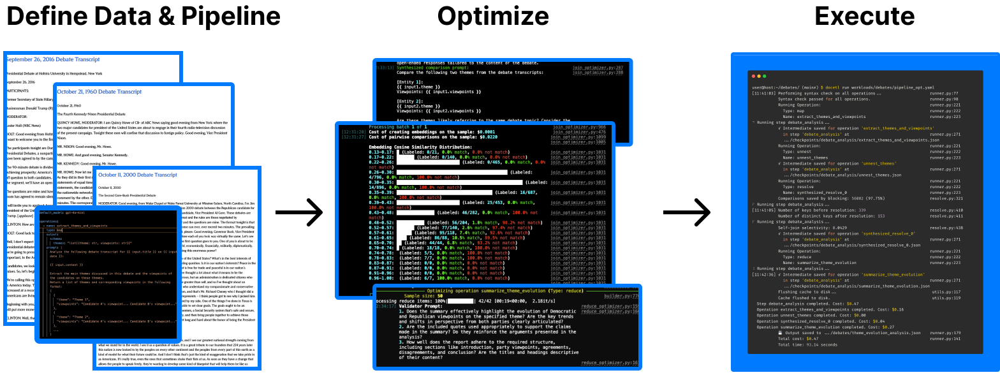
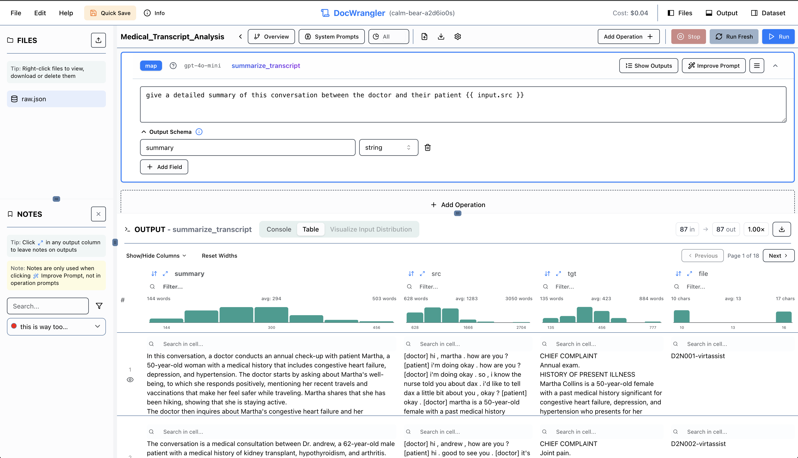

# 📜 DocETL: Powering Complex Document Processing Pipelines

[](https://docetl.org)
[](https://ucbepic.github.io/docetl)
[](https://discord.gg/fHp7B2X3xx)
[](https://arxiv.org/abs/2410.12189)



DocETL is a tool for creating and executing data processing pipelines, especially suited for complex document processing tasks. It offers:

1. An interactive UI playground for iterative prompt engineering and pipeline development
2. A Python package for running production pipelines from the command line or Python code

> 💡 **Need Help Writing Your Pipeline?**  
> Want to use an LLM like ChatGPT or Claude to help you write your pipeline? See [docetl.org/llms.txt](https://docetl.org/llms.txt) for a big prompt you can copy paste into ChatGPT or Claude, before describing your task.


### 🌟 Community Projects

- [Conversation Generator](https://github.com/PassionFruits-net/docetl-conversation)
- [Text-to-speech](https://github.com/PassionFruits-net/docetl-speaker)
- [YouTube Transcript Topic Extraction](https://github.com/rajib76/docetl_examples)

### 📚 Educational Resources

- [UI/UX Thoughts](https://x.com/sh_reya/status/1846235904664273201)
- [Using Gleaning to Improve Output Quality](https://x.com/sh_reya/status/1843354256335876262)
- [Deep Dive on Resolve Operator](https://x.com/sh_reya/status/1840796824636121288)


## 🚀 Getting Started

There are two main ways to use DocETL:

### 1. 🎮 DocWrangler, the Interactive UI Playground (Recommended for Development)

[DocWrangler](https://docetl.org/playground) helps you iteratively develop your pipeline:
- Experiment with different prompts and see results in real-time
- Build your pipeline step by step
- Export your finalized pipeline configuration for production use



DocWrangler is hosted at [docetl.org/playground](https://docetl.org/playground). But to run the playground locally, you can either:
- Use Docker (recommended for quick start): `make docker`
- Set up the development environment manually

See the [Playground Setup Guide](https://ucbepic.github.io/docetl/playground/) for detailed instructions.

### 2. 📦 Python Package (For Production Use)

If you want to use DocETL as a Python package:

#### Prerequisites
- Python 3.10 or later
- OpenAI API key

```bash
pip install docetl
```

Create a `.env` file in your project directory:
```bash
OPENAI_API_KEY=your_api_key_here  # Required for LLM operations (or the key for the LLM of your choice)
```

> ⚠️ **Important: Two Different .env Files**
> - **Root `.env`**: Used by the backend Python server that executes DocETL pipelines
> - **`website/.env.local`**: Used by the frontend TypeScript code in DocWrangler (UI features like improve prompt and chatbot)

To see examples of how to use DocETL, check out the [tutorial](https://ucbepic.github.io/docetl/tutorial/).

### 2. 🎮 DocWrangler Setup

To run DocWrangler locally, you have two options:

#### Option A: Using Docker (Recommended for Quick Start)

The easiest way to get the DocWrangler playground running:

1. Create the required environment files:

Create `.env` in the root directory (for the backend Python server that executes pipelines):
```bash
OPENAI_API_KEY=your_api_key_here  # Used by DocETL pipeline execution engine
# BACKEND configuration
BACKEND_ALLOW_ORIGINS=http://localhost:3000,http://127.0.0.1:3000
BACKEND_HOST=localhost
BACKEND_PORT=8000
BACKEND_RELOAD=True

# FRONTEND configuration
FRONTEND_HOST=0.0.0.0
FRONTEND_PORT=3000

# Host port mapping for docker-compose (if not set, defaults are used in docker-compose.yml)
FRONTEND_DOCKER_COMPOSE_PORT=3031
BACKEND_DOCKER_COMPOSE_PORT=8081

# Supported text file encodings
TEXT_FILE_ENCODINGS=utf-8,latin1,cp1252,iso-8859-1
```

Create `.env.local` in the `website` directory (for DocWrangler UI features like improve prompt and chatbot):
```bash
OPENAI_API_KEY=sk-xxx  # Used by TypeScript features: improve prompt, chatbot, etc.
OPENAI_API_BASE=https://api.openai.com/v1
MODEL_NAME=gpt-4o-mini  # Model used by the UI assistant

NEXT_PUBLIC_BACKEND_HOST=localhost
NEXT_PUBLIC_BACKEND_PORT=8000
NEXT_PUBLIC_HOSTED_DOCWRANGLER=false
```

2. Run Docker:
```bash
make docker
```

This will:
- Create a Docker volume for persistent data
- Build the DocETL image
- Run the container with the UI accessible at http://localhost:3000

To clean up Docker resources (note that this will delete the Docker volume):
```bash
make docker-clean
```

##### AWS Bedrock

This framework supports integration with AWS Bedrock. To enable:

1. Configure AWS credentials:
```bash
aws configure
```

2. Test your AWS credentials:
```bash
make test-aws
```

3. Run with AWS support:
```bash
AWS_PROFILE=your-profile AWS_REGION=your-region make docker
```

Or using Docker Compose:
```bash
AWS_PROFILE=your-profile AWS_REGION=your-region docker compose --profile aws up
```

Environment variables:
- `AWS_PROFILE`: Your AWS CLI profile (default: 'default')
- `AWS_REGION`: AWS region (default: 'us-west-2')

Bedrock models are pefixed with `bedrock`. See liteLLM [docs](https://docs.litellm.ai/docs/providers/bedrock#supported-aws-bedrock-models) for more details.

#### Option B: Manual Setup (Development)

For development or if you prefer not to use Docker:

1. Clone the repository:
```bash
git clone https://github.com/ucbepic/docetl.git
cd docetl
```

2. Set up environment variables in `.env` in the root/top-level directory (for the backend Python server):
```bash
OPENAI_API_KEY=your_api_key_here  # Used by DocETL pipeline execution engine
# BACKEND configuration
BACKEND_ALLOW_ORIGINS=http://localhost:3000,http://127.0.0.1:3000
BACKEND_HOST=localhost
BACKEND_PORT=8000
BACKEND_RELOAD=True

# FRONTEND configuration
FRONTEND_HOST=0.0.0.0
FRONTEND_PORT=3000

# Host port mapping for docker-compose (if not set, defaults are used in docker-compose.yml)
FRONTEND_DOCKER_COMPOSE_PORT=3031
BACKEND_DOCKER_COMPOSE_PORT=8081

# Supported text file encodings
TEXT_FILE_ENCODINGS=utf-8,latin1,cp1252,iso-8859-1
```

And create an .env.local file in the `website` directory (for DocWrangler UI features):
```bash
OPENAI_API_KEY=sk-xxx  # Used by TypeScript features: improve prompt, chatbot, etc.
OPENAI_API_BASE=https://api.openai.com/v1
MODEL_NAME=gpt-4o-mini  # Model used by the UI assistant

NEXT_PUBLIC_BACKEND_HOST=localhost
NEXT_PUBLIC_BACKEND_PORT=8000
NEXT_PUBLIC_HOSTED_DOCWRANGLER=false
```

3. Install dependencies:
```bash
make install      # Install Python deps with uv and set up pre-commit
make install-ui   # Install UI dependencies
```

If you prefer using uv directly instead of Make:
```bash
curl -LsSf https://astral.sh/uv/install.sh | sh
uv sync --all-groups --all-extras
```


4. Start the development server:
```bash
make run-ui-dev
```

5. Visit http://localhost:3000/playground to access the interactive UI.

### 🛠️ Development Setup

If you're planning to contribute or modify DocETL, you can verify your setup by running the test suite:

```bash
make tests-basic  # Runs basic test suite (costs < $0.01 with OpenAI)
```

For detailed documentation and tutorials, visit our [documentation](https://ucbepic.github.io/docetl).
