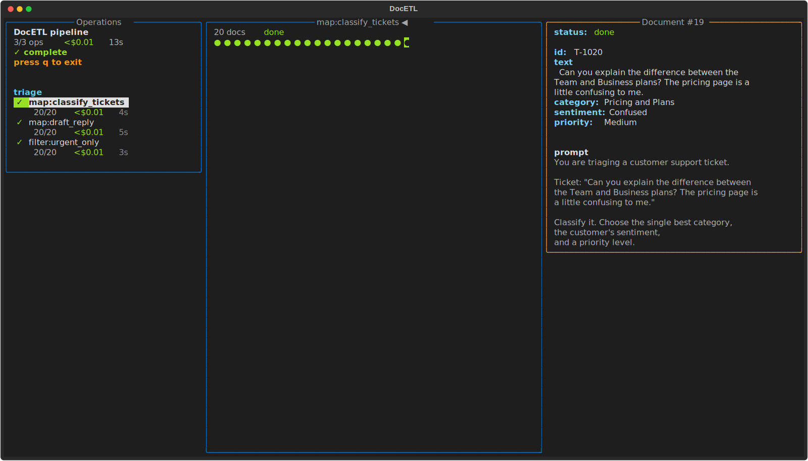
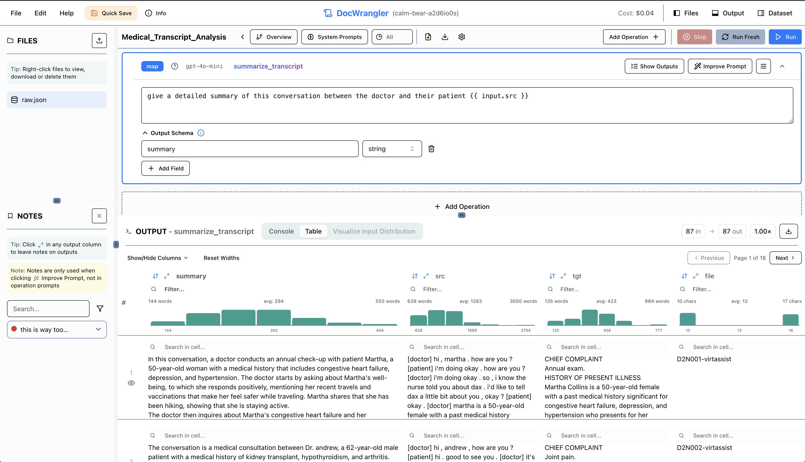

<div align="center">

# DocETL

[](https://docetl.org)
[](https://ucbepic.github.io/docetl)
[](https://discord.gg/fHp7B2X3xx)

[What is DocETL](#what-is-docetl) · [Install](#install) · [Python API](#python-api-recommended) · [YAML](#yaml-low-code) · [DocWrangler UI](#docwrangler-ui) · [Docs](#documentation)

</div>

---

## What is DocETL

DocETL is a declarative query engine and optimizer for LLM-powered data processing.

- **Operations on documents** — map, reduce, filter, resolve, extract, and more, each backed by LLM calls
- **Long-document handling** — automatically splits documents that exceed context windows and reassembles results
- **Output validation** — define expected schemas and rules; failed outputs are retried automatically
- **Entity resolution** — deduplicate entities across documents using LLM-based fuzzy matching
- **Cost-accuracy optimizer** — rewrites pipelines by searching over models, prompts, and operation decompositions

<table>
<tr>
<td width="50%">
<strong>Progress TUI</strong><br>

</td>
<td width="50%">
<strong>DocWrangler UI</strong><br>

</td>
</tr>
</table>

---

## Install

```bash
pip install docetl
export OPENAI_API_KEY=your_key   # or any LLM provider key
```

---

## Python API (recommended)

Best for production code, notebooks, and scripting. [Full guide](https://ucbepic.github.io/docetl/python/)

```python
import docetl

docetl.default_model = "gpt-4o-mini"
docetl.rate_limits = {"gpt-4o-mini": {"rpm": 500, "tpm": 200000}}

pipeline = (
    docetl.read_json("tickets.json")
    .map(
        prompt="Classify this support ticket: {{ input.text }}",
        output={"schema": {"category": "str", "priority": "str"}},
    )
    .reduce(
        reduce_key="category",
        prompt="Summarize these tickets: {{ t.text }}",
        output={"schema": {"summary": "str"}},
    )
)

df = pipeline.collect()
print(f"Cost: ${pipeline.total_cost:.4f}")
```

---

## YAML (low-code)

Declare your pipeline in a config file — no Python needed. [Tutorial](https://ucbepic.github.io/docetl/tutorial/)

```yaml
datasets:
  tickets:
    type: file
    path: tickets.json

default_model: gpt-4o-mini

operations:
  - name: classify
    type: map
    prompt: "Classify this support ticket and assign a priority level."
    output:
      schema:
        category: str
        priority: str

pipeline:
  steps:
    - name: triage
      input: tickets
      operations: [classify]
  output:
    type: file
    path: output.json
```

```bash
docetl run pipeline.yaml
```

---

## DocWrangler UI

Visual playground for interactive prompt development. Edit prompts, see results in real time. Try it at [docetl.org/playground](https://docetl.org/playground) or [run it locally](https://ucbepic.github.io/docetl/playground/).

---

## Documentation

| | |
|---|---|
| [Python API Guide](https://ucbepic.github.io/docetl/python/) | Frame API reference — operations, config, optimization |
| [YAML Tutorial](https://ucbepic.github.io/docetl/tutorial/) | Step-by-step walkthrough of declarative pipelines |
| [Operators](https://ucbepic.github.io/docetl/operators/map/) | Map, filter, reduce, resolve, split, gather, extract, and more |
| [Optimization](https://ucbepic.github.io/docetl/optimization/python-api/) | Automatic cost-accuracy optimization with MOAR |
| [DocWrangler Setup](https://ucbepic.github.io/docetl/playground/) | Run the interactive UI locally or via Docker |
| [Claude Code Quick Start](https://ucbepic.github.io/docetl/quickstart-claude-code/) | Describe your task and let Claude build the pipeline |

---

## Community

[Discord](https://discord.gg/fHp7B2X3xx) · [Conversation Generator](https://github.com/PassionFruits-net/docetl-conversation) · [Text-to-Speech](https://github.com/PassionFruits-net/docetl-speaker) · [YouTube Transcript Topics](https://github.com/rajib76/docetl_examples)

---

## Development

```bash
git clone https://github.com/ucbepic/docetl.git && cd docetl
make install
make tests-basic  # < $0.01 with OpenAI
```

---

## Papers

DocETL was created at the [EPIC Data Lab](https://epic.berkeley.edu/) and [Data Systems and Foundations](https://dsf.berkeley.edu/) group at UC Berkeley.

**DocETL** — VLDB 2025 ([paper](https://arxiv.org/abs/2410.12189))

```bibtex
@article{shankar2025docetl,
  title={DocETL: Agentic Query Rewriting and Evaluation for Complex Document Processing},
  author={Shankar, Shreya and Chambers, Tristan and Shah, Tarak and Parameswaran, Aditya G and Wu, Eugene},
  journal={Proceedings of the VLDB Endowment},
  volume={18}, number={9}, pages={3035--3048}, year={2025}
}
```

**DocWrangler** — UIST 2025, Best Paper Honorable Mention ([paper](https://arxiv.org/abs/2504.14764))

```bibtex
@inproceedings{shankar2025docwrangler,
  title={Steering Semantic Data Processing With DocWrangler},
  author={Shankar*, Shreya and Chopra*, Bhavya and Hasan, Mawil and Lee, Stephen and Hartmann, Bj{\"o}rn and Hellerstein, Joseph M and Parameswaran, Aditya G and Wu, Eugene},
  booktitle={Proceedings of the ACM Symposium on User Interface Software and Technology (UIST)},
  year={2025}
}
```

**MOAR** — VLDB 2026 ([paper](https://arxiv.org/abs/2512.02289))

```bibtex
@article{wei2026moar,
  title={Multi-Objective Agentic Rewrites for Unstructured Data Processing},
  author={Wei*, Lindsey Linxi and Shankar*, Shreya and Zeighami, Sepanta and Chung, Yeounoh and Ozcan, Fatma and Parameswaran, Aditya G},
  journal={Proceedings of the VLDB Endowment}, year={2026}
}
```

*\*Co-first authors*
