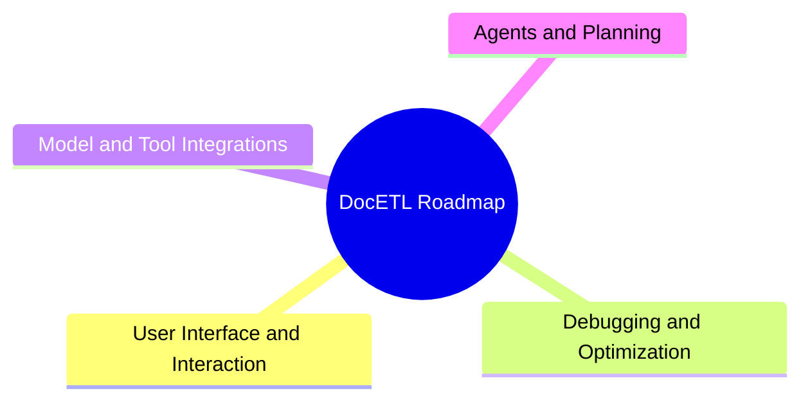

# Roadmap

!!! info "Join Our Working Groups"

    Are you interested in contributing to any of these projects or have ideas for new areas of exploration? Join our [Discord server](https://discord.gg/fHp7B2X3xx) to participate in our working groups and collaborate with the community!

We're constantly working to improve DocETL and explore new possibilities in document processing. Our current ideas span both research and engineering problems, and are organized into the following categories:

## User Interface and Interaction

- **Natural Language to DocETL Pipeline**: Building tools to generate DocETL pipelines from natural language descriptions.
- **Interactive Pipeline Creation**: Developing intuitive interfaces for creating and optimizing DocETL pipelines interactively.

## Debugging and Optimization

- **DocETL Debugger**: Creating a debugger with provenance tracking, allowing users to visualize all intermediates that contributed to a specific output.
- **Plan Efficiency Optimization**: Implementing strategies (and devising new strategies) to reduce latency and cost for the most accurate plans. This includes batching LLM calls, using model cascades, and fusing operators.

## Model and Tool Integrations

- **Model Diversity**: Extending support beyond OpenAI to include a wider range of models, with a focus on local models.
- **OCR and PDF Extraction**: Improving integration with OCR technologies and PDF extraction tools for more robust document processing.
- **Multimodal Data Processing**: Enhancing DocETL to handle multimodal data, including text, images, audio, and video (as many of the LLMs support multimodal inputs, anyways).

## Agents and Planning

- **Smarter Agent and Planning Architectures**: Optimizing plan exploration based on data characteristics. For instance, refining the optimizer to avoid unnecessary exploration of plans with the [gather operator](../operators/gather.md) for tasks that don't require peripheral context when decomposing map operations for large documents.

- **Context-Aware Sampling for Validation**: Creating algorithms that can identify and extract the most representative samples from different parts of a document, including the beginning, middle, and end, to use in validaton prompts. This approach will help validation agents to verify that all sections of documents are adequately represented in the outputs, avoiding blind spots in the analysis due to truncation--as we currently naive truncate the middle of documents in validation prompts.

- **Benchmarks**: Developing a suite of benchmarks to evaluate the performance of different optimization strategies and agent architectures. These benchmarks will help us understand the trade-offs between accuracy, efficiency, and cost in different scenarios, guiding the development of more effective optimization techniques.
