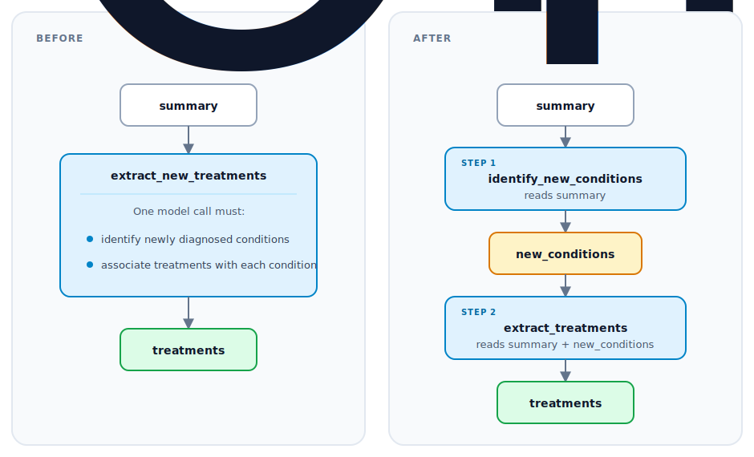

# Adding a MOAR rewrite directive

This guide describes how to add a rewrite directive to MOAR. A rewrite directive
lets MOAR test a new kind of pipeline change. Follow steps 1 to 6 to implement
and register the directive. Then test the directive and confirm that MOAR uses
it during a search.

The `chaining` directive included with DocETL is one example. MOAR can use it to
replace one complex operation with a sequence of simpler map operations.

```text
Op  =>  Map* -> Op
```

You define which pipeline changes are valid. During a search, the rewrite agent
writes the intermediate tasks and prompts for one target operation. DocETL
checks the changed pipeline before MOAR runs and scores it.

The code examples follow the implementation in
[`docetl/reasoning_optimizer/directives/chaining.py`](https://github.com/ucbepic/docetl/blob/main/docetl/reasoning_optimizer/directives/chaining.py).

## How MOAR uses a directive

MOAR uses the same process for every directive.

1. The search agent reads `name`, `formal_description`, `nl_description`, and
   `when_to_use`, then selects a directive and one or more target operations.
2. The directive asks the rewrite agent for an object that matches the
   instantiate schema.
3. Your validation code checks the proposed configuration.
4. `apply()` returns a new operation list, and DocETL statically validates the
   complete candidate pipeline before executing it.
5. MOAR runs the candidate and evaluates its accuracy and cost.

The schema limits what the rewrite agent may return. The `apply()` method builds
the changed pipeline without another model call.

## Medical extraction example

Suppose a pipeline contains a map operation that must identify newly diagnosed
conditions and associate treatments with them in one call.

!!! example "Example input, the pipeline author's operation"
    The pipeline author writes the original operation. The directive receives
    the operation as input during optimization.

    ```yaml
    - name: extract_new_treatments
      type: map
      prompt: |
        From this discharge summary, extract every treatment
        prescribed specifically for a newly diagnosed condition.

        {{ input.summary }}
      output:
        schema:
          treatments: list[str]
    ```

The operation combines two dependent decisions:

1. Which conditions are newly diagnosed?
2. Which treatments were prescribed for those conditions?

MOAR can apply chaining to replace the operation with two dependent maps.



Both plans accept `summary` and produce `treatments`. In the changed plan,
`new_conditions` is an intermediate result for the second map.

You write rules for any chaining rewrite. While MOAR runs, the rewrite agent
chooses the medical tasks for the target operation.

You will use the medical example in each step, so you can compare the general
instructions with the chaining code.

## 1. Define the instantiate schema

In this step, you define the Pydantic model for the rewrite agent's output.
DocETL calls the model an instantiate schema. Add the schema to
`docetl/reasoning_optimizer/instantiate_schemas.py`.

!!! abstract "Your code, the instantiate schema"
    You write the following classes to define the fields that the rewrite agent
    must return.

    ```python
    class MapOpConfig(BaseModel):
        name: str
        prompt: str
        output_keys: list[str]


    class ChainingInstantiateSchema(BaseModel):
        new_ops: list[MapOpConfig]
    ```

!!! example "Runtime example, output from the rewrite agent"
    At runtime, the rewrite agent may return the following object for the
    medical operation. A pipeline author does not write the object.

    ```python
    ChainingInstantiateSchema(
        new_ops=[
            MapOpConfig(
                name="identify_new_conditions",
                prompt="""
                Read this discharge summary:

                {{ input.summary }}

                List only conditions explicitly described as newly diagnosed.
                """,
                output_keys=["new_conditions"],
            ),
            MapOpConfig(
                name="extract_treatments",
                prompt="""
                Read this discharge summary:

                {{ input.summary }}

                Newly diagnosed conditions:
                {{ input.new_conditions }}

                List the treatments prescribed for each new condition.
                """,
                output_keys=["treatments"],
            ),
        ]
    )
    ```

Use narrow fields and describe them clearly. If a directive needs only two
prompts and their output keys, do not ask the agent to return an entire
pipeline.

## 2. Validate the agent's proposal

In this step, you reject agent output that cannot produce a valid pipeline. For
chaining, reject the agent's proposal unless all of the following statements
are true:

- Every generated map prompt contains an `{{ input.<key> }}` reference.
- Every input key used by the original operation appears in at least one new
  prompt.
- The last map declares exactly the original operation's output keys.

In the medical example, `summary` is a required input and `treatments` is the
required final output. A chain that ends at `new_conditions` is invalid.

The later map may use `{{ input.new_conditions }}` because the earlier map
produces `new_conditions`. After `apply()` runs, DocETL also checks the complete
pipeline without running it. If a directive has stricter rules for dependencies,
check the rules in its instantiate schema. MOAR can then reject an error before
execution.

The agent can return an invalid or incomplete configuration even when you use
structured output. Return the validation error to the agent, and limit the
number of retries. The directives included with DocETL use
`MAX_DIRECTIVE_INSTANTIATION_ATTEMPTS` as their shared limit.

## 3. Describe when MOAR should use the directive

In this step, you describe the directive so the search agent knows when to
choose it. Create a subclass of `Directive` under
`docetl/reasoning_optimizer/directives/`. The search agent reads the four
descriptive fields when it chooses a directive.

```python
class ChainingDirective(Directive):
    name: str = Field(default="chaining")
    formal_description: str = Field(default="Op => Map* -> Op")
    nl_description: str = Field(
        default=(
            "Decompose a complex operation into a sequence by inserting one "
            "or more Map steps that rewrite the input for the next operation."
        )
    )
    when_to_use: str = Field(
        default=(
            "When the original task is too complex for one step and should be "
            "split into a series of dependent steps."
        )
    )
    instantiate_schema_type: Type[BaseModel] = ChainingInstantiateSchema
```

Write `when_to_use` so the search agent can choose among the available
directives. Describe a property that the search agent can find in a target
operation. For example, chaining applies when an operation contains dependent
reasoning steps. Do not claim that every use of the directive improves
accuracy.

The base class also requires an `example` and may include `test_cases`. The
rewrite agent receives the example in its prompt. Use a complete example that
preserves the input fields, output fields, and prompt instructions.

## 4. Generate and validate a rewrite instance

In this step, you ask the rewrite agent for a configuration and check the
configuration against the schema. Use `to_string_for_instantiate()` and
`llm_instantiate()` for the model call.

```python
response = completion(
    model=agent_llm,
    messages=messages,
    response_format=ChainingInstantiateSchema,
)

payload = json.loads(response.choices[0].message.content)
rewrite = ChainingInstantiateSchema(**payload)
ChainingInstantiateSchema.validate_chain(
    new_ops=rewrite.new_ops,
    required_input_keys=expected_input_keys,
    expected_output_keys=expected_output_keys,
)
```

Return the schema, updated message history, and model call cost from
`llm_instantiate()`. MOAR adds the rewrite agent call cost to the total search
cost.

Use `instantiate()` to complete the following work in order:

1. Check the number and types of target operations.
2. Read the target's required input and output keys.
3. Call `llm_instantiate()`.
4. Call the deterministic `apply()` method.
5. Return `(new_ops, message_history, call_cost)`.

MOAR provides every directive with additional values such as the optimization
goal and dataset. It also provides the allowed models and input path. Accept
`**kwargs` when the directive does not use every value.

## 5. Apply the rewrite

In this step, you build the changed pipeline from the validated configuration.
Do not call a model from `apply()`. Copy the operation list and build the
replacement operations, then return the new list. The main part of the chaining
implementation follows.

```python
def apply(self, global_default_model, ops_list, target_op, rewrite):
    new_ops_list = deepcopy(ops_list)
    position = next(
        i for i, op in enumerate(new_ops_list) if op["name"] == target_op
    )
    original = new_ops_list[position]
    model = original.get("model", global_default_model)

    replacement = []
    for index, step in enumerate(rewrite.new_ops):
        output = (
            original["output"]
            if index == len(rewrite.new_ops) - 1
            else {
                "schema": {key: "string" for key in step.output_keys}
            }
        )
        replacement.append(
            {
                "name": step.name,
                "type": "map",
                "prompt": step.prompt,
                "model": model,
                "litellm_completion_kwargs": {"temperature": 0},
                "output": output,
            }
        )

    new_ops_list[position : position + 1] = replacement
    return new_ops_list
```

The last map uses the original output block. The changed pipeline therefore has
the same final output fields and field types as the original pipeline.

## 6. Register the directive

In this step, you make the directive available to MOAR. Import the directive and
add an instance to `docetl/reasoning_optimizer/directives/__init__.py`.

```python
from .my_directive import MyDirective

ALL_DIRECTIVES = [
    # ...
    MyDirective(),
]
```

After you add the instance to `ALL_DIRECTIVES`, the accuracy search can use the
directive. The code also adds the directive to `DIRECTIVE_REGISTRY`. Update
`__all__` as well.

Register the directive in another list only when one of the following
conditions applies:

| Registry | Add the directive when |
| --- | --- |
| `ALL_COST_DIRECTIVES` | The search agent should consider it during cost optimization. |
| `MULTI_INSTANCE_DIRECTIVES` | MOAR should ask for two distinct instantiations per selection. |
| `DIRECTIVE_GROUPS` | After a poor result, MOAR should skip equivalent rewrites for the same operation. |

Only add a directive to the cost list when you can explain how it may reduce
cost. A rewrite that only adds model calls normally belongs in the accuracy
search.

## Test the directive

Test code that does not call a model separately from tests that call a model.

### Schema tests

Test valid and invalid configurations directly. At minimum, test a missing
original input and a missing final output. Also test an empty chain and
duplicate operation names. If the directive limits intermediate fields, test a
reference to a field that no earlier operation produced.

```python
def test_chaining_rejects_wrong_final_output():
    rewrite = ChainingInstantiateSchema(
        new_ops=[
            MapOpConfig(
                name="identify_new_conditions",
                prompt="Read {{ input.summary }}",
                output_keys=["new_conditions"],
            )
        ]
    )

    with pytest.raises(ValueError, match="do not match"):
        ChainingInstantiateSchema.validate_chain(
            rewrite.new_ops,
            required_input_keys=["summary"],
            expected_output_keys=["treatments"],
        )
```

### Tests for `apply()`

Construct the schema by hand and call `apply()`. Check the operation order,
names, models, and intermediate schemas. Also check that the final output schema
matches the original schema. Add the test to
`tests/reasoning_optimizer/test_directive_apply.py`.

```bash
uv run pytest tests/reasoning_optimizer/test_directive_apply.py -k chaining
```

### Tests for complete pipelines and several rewrites

An operation list can pass a test for `apply()` and still contain a broken input
reference. A later rewrite can also fail on an operation that the first rewrite
added. In `tests/test_moar_multistep.py`, add a test that updates the complete
pipeline and runs plan validation. When relevant, apply a second directive to
an operation that the first directive added.

```bash
uv run pytest tests/test_moar_multistep.py -k chaining
```

### Live agent tests

`Directive.run_tests()` calls one model to create the rewrite and another model
to judge it. Use the command as an integration test, but keep the deterministic
tests described above.

```bash
uv run python -m tests.reasoning_optimizer.test_runner \
  --directive chaining \
  --model gpt-4.1
```

The command requires credentials for the selected model. Model output may vary
between runs, so record the model, prompt version, test data, and pass rate over
repeated runs.

## Confirm that MOAR uses the directive

Check each stage separately because registration does not prove that MOAR
selected the directive, built a valid pipeline, or improved the score.

| Claim | Check |
| --- | --- |
| Registered | Print the names in `ALL_DIRECTIVES` or `DIRECTIVE_REGISTRY`. |
| Available to search | Find the directive in the action counts in `moar_tree_log.txt`. |
| Selected | Look for `Directive: <name>, Target ops: [...]` in the console or a nonzero use count in the tree log. |
| Pipeline built | Open the generated `<pipeline-name>_<node-id>.yaml` and inspect the changed operations. |
| Helpful | Compare its score and cost with its parent, and check whether MOAR keeps it among the best plans. |

Confirm registration without making an LLM call.

```bash
uv run python -c \
  "from docetl.reasoning_optimizer.directives import ALL_DIRECTIVES; print([d.name for d in ALL_DIRECTIVES])"
```

Then run a small MOAR experiment with an explicit `save_dir`. MOAR writes the
search log to `<save_dir>/moar_tree_log.txt`.

```bash
rg -n "my_directive|Action: my_directive" results/moar_tree_log.txt
```

A zero use count means that the directive was available but MOAR did not select
it. A nonzero count means that MOAR selected the directive. The count does not
prove that MOAR built or ran the candidate, so also inspect the console output
and generated YAML.

For a deterministic MOAR integration test, construct `MOARSearch` with
`available_actions={MyDirective()}` and a fixed test evaluation. The limited
action set prevents the search agent from choosing another directive. Also keep
a benchmark that includes every directive, because the search agent must
recognize when the new directive applies.

## Implementation checklist

| Part | Chaining example |
| --- | --- |
| Pattern | One complex operation |
| Replacement | A sequence of map operations |
| Selection metadata | Use for dependent reasoning steps |
| Instantiate schema | A list of map names, prompts, and output keys |
| Validation | Preserve original inputs and final output contract |
| Apply | Replace one operation with the generated sequence |
| Tests without model calls | Schema, operation shape, and static plan validity |
| Tests with models and data | Selection rate, execution success, accuracy, and cost |
