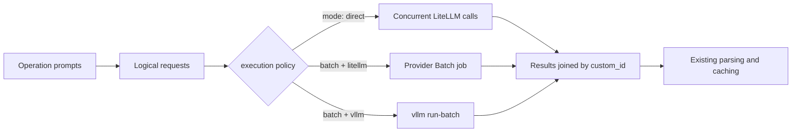

# Deferred Batch Execution

DocETL normally sends each LLM request immediately from a per-row thread pool.
Adding an `execution` block to a map or reduce operation routes the same
requests through a small execution compiler instead: the operation renders its
prompts into provider-neutral logical requests, and the configured policy
decides whether they run as concurrent direct calls, as a hosted provider
Batch job, or as an offline `vllm run-batch` job.



Caching, schema parsing, and operation semantics sit above this boundary, so
changing the physical target does not change prompts or result parsing.
Omitting `execution` leaves the operation on DocETL's original direct path,
unchanged.

This is different from `batch_prompt`:

| Feature | What is batched | LLM requests |
| --- | --- | --- |
| `batch_prompt` | Several input rows inside one prompt | One request per group of rows |
| `execution.mode: batch` | The execution schedule | One request per row, submitted as one job |

The second form preserves row-level prompts and output parsing while moving
execution out of the per-row thread pool — for example onto a provider Batch
API, where OpenAI sells the same tokens at a 50% discount in exchange for a
completion window of up to 24 hours.

## Direct execution through the compiler

Explicit direct mode runs the compiled requests with ordinary concurrent
LiteLLM completions. It is useful for testing an operation's compiled requests
cheaply before moving a high-volume operation to a batch backend.

=== "YAML"

    ```yaml
    - name: extract_facts
      type: map
      model: gpt-4o-mini
      prompt: "Extract facts from {{ input.text }}"
      output:
        schema:
          facts: list[str]
      execution:
        mode: direct
        concurrency: 20
    ```

=== "Python"

    ```python
    facts = (
        docetl.read_json("documents.json")
        .map(
            prompt="Extract facts from {{ input.text }}",
            output={"schema": {"facts": "list[str]"}},
            model="gpt-4o-mini",
            execution={"mode": "direct", "concurrency": 20},
        )
        .collect()
    )
    ```

## Hosted provider batches through LiteLLM

DocETL uses LiteLLM's Files and Batches abstraction for the hosted job
lifecycle. LiteLLM currently documents Batch support for OpenAI, Azure OpenAI,
Vertex AI, Bedrock, and hosted vLLM. This is a smaller set than the providers
supported by ordinary LiteLLM completions.

=== "YAML"

    ```yaml
    - name: classify_documents
      type: map
      model: openai/gpt-4o-mini
      prompt: "Classify this document: {{ input.text }}"
      output:
        schema:
          category: string
      execution:
        mode: batch
        backend: litellm
        provider: openai # optional when it can be inferred from model
        completion_window: 24h
        poll_interval_seconds: 30
    ```

=== "Python"

    ```python
    results = (
        docetl.read_json("documents.json")
        .map(
            prompt="Classify this document: {{ input.text }}",
            output={"schema": {"category": "string"}},
            model="openai/gpt-4o-mini",
            execution={
                "mode": "batch",
                "backend": "litellm",
                "provider": "openai",
                "completion_window": "24h",
                "poll_interval_seconds": 30,
            },
        )
        .collect()
    )
    ```

DocETL infers the provider adapter from a normal LiteLLM model string, so for
supported providers changing `openai/gpt-4o-mini` to a model such as
`vertex_ai/gemini-...` is enough. Set `provider` explicitly when using a model
alias or custom routing. If you use a LiteLLM model alias for multi-account
routing, set `routing_model` in the execution block as well.

DocETL applies OpenAI's published 0.5 batch price multiplier to its estimated
cost only when `provider: openai`. Other providers set their own batch pricing
and lifecycle rules, so set `cost_multiplier` explicitly if you want the
estimated cost to reflect them.

Provider batches are split at 50,000 requests or 200 MB by default, matching
OpenAI's per-batch limits. Set `max_batch_requests` or `max_batch_bytes` to a
smaller provider-specific limit when needed.

## Offline batches with vLLM

The vLLM backend writes the same JSONL requests and invokes `vllm run-batch`
as a subprocess. This is useful for an ephemeral GPU worker: start the worker,
load the model once, process the dataset, write the results, and shut the
worker down.

=== "YAML"

    ```yaml
    - name: classify_documents
      type: map
      model: Qwen/Qwen3-8B
      prompt: "Classify this document: {{ input.text }}"
      output:
        schema:
          category: string
      execution:
        mode: batch
        backend: vllm
        model: Qwen/Qwen3-8B
        request_defaults:
          max_tokens: 512
          min_tokens: 1
        engine_args:
          tensor_parallel_size: 2
          gpu_memory_utilization: 0.9
          max_model_len: 4096
          max_num_seqs: 256
          enforce_eager: false
    ```

=== "Python"

    ```python
    results = (
        docetl.read_json("documents.json")
        .map(
            prompt="Classify this document: {{ input.text }}",
            output={"schema": {"category": "string"}},
            model="Qwen/Qwen3-8B",
            execution={
                "mode": "batch",
                "backend": "vllm",
                "model": "Qwen/Qwen3-8B",
                "request_defaults": {"max_tokens": 512, "min_tokens": 1},
                "engine_args": {
                    "tensor_parallel_size": 2,
                    "gpu_memory_utilization": 0.9,
                    "max_model_len": 4096,
                },
            },
        )
        .collect()
    )
    ```

`request_defaults` become fields in each request body. `engine_args` become
vLLM CLI flags by converting underscores to hyphens; for example,
`tensor_parallel_size` becomes `--tensor-parallel-size`. Use vLLM's own option
names (`max_model_len`, not `max_model_length`). A false boolean is omitted,
while a true boolean becomes a flag.

An always-on vLLM or SGLang OpenAI-compatible server can already be used for
ordinary DocETL calls through LiteLLM. That provides continuous batching inside
the server, but it is not a durable offline job and does not start or stop GPU
capacity. Use the vLLM backend above when the job lifecycle is the objective.

## Durability and ordering

DocETL writes batch artifacts under `.docetl/batches/<job-hash>/` by default:

- `input.jsonl` contains the compiled requests.
- `manifest.json` records a hosted provider batch ID.
- `output.jsonl` and `errors.jsonl` contain downloaded results.

After the provider job ID has been written to the manifest, rerunning the same
operation resumes that job instead of submitting (and paying for) a duplicate.
Completed outputs are reused locally, and if collection stops between
downloading the provider's success and error files, the next run retrieves the
same job and completes the checkpoint. The command-line runner currently waits
synchronously after submitting a job, but because the job identity and inputs
are durable, stopping the pipeline mid-wait is safe.

Provider output order is not trusted; DocETL joins responses to inputs by
`custom_id` and restores input order.

Identical runners that share the same POSIX `work_dir` are serialized with a
per-job advisory file lock, including when they are separate processes. Use a
filesystem with working advisory-lock semantics when several machines share
the directory; an object-store mount is not automatically a distributed lock.
Use `work_dir` to put these artifacts on persistent storage when the process
or node filesystem is ephemeral.

One narrow window remains: if the process dies after a provider accepts a job
but before the returned job ID reaches the manifest, a rerun cannot discover
the unrecorded job and may submit another. Closing it would require provider
idempotency support or an external job registry, so DocETL promises resume
after manifest publication rather than exactly-once submission across two
systems.

### Deadline fallback

For a background job with a hard application deadline, a provider batch can
fall back to the ordinary direct API:

=== "YAML"

    ```yaml
    - name: classify_documents
      type: map
      model: openai/gpt-4o-mini
      prompt: "Classify this document: {{ input.text }}"
      output:
        schema:
          category: string
      execution:
        mode: batch
        backend: litellm
        provider: openai
        deadline_seconds: 5400
        fallback:
          mode: direct
          concurrency: 50
          direct_kwargs: {} # optional direct-provider client settings
    ```

=== "Python"

    ```python
    results = (
        docetl.read_json("documents.json")
        .map(
            prompt="Classify this document: {{ input.text }}",
            output={"schema": {"category": "string"}},
            model="openai/gpt-4o-mini",
            execution={
                "mode": "batch",
                "backend": "litellm",
                "provider": "openai",
                "deadline_seconds": 5400,
                "fallback": {"mode": "direct", "concurrency": 50},
            },
        )
        .collect()
    )
    ```

DocETL atomically records which side won — provider batch or direct — for the
plan. Once the direct fallback wins, a late batch result is never published,
and successful direct results are persisted and replayed on a rerun, so the
fallback cannot produce duplicate outputs. Provider-side cancellation is not
assumed to be reliable; correctness comes from the recorded winner, not from
cancelling the job.

## Batches and dependent operations

A compiled plan holds one set of independent requests. Anything that depends
on a result — a local transform, a downstream operation — starts a new plan
after the current one completes. A `map -> filter -> map` pipeline in batch
mode therefore submits three provider jobs in sequence.

Simple `reduce` is supported because grouping happens locally before any model
call: the compiled plan holds one request per group.

=== "YAML"

    ```yaml
    - name: summarize_accounts
      type: reduce
      reduce_key: account_id
      prompt: "Summarize these events for the account: {{ inputs }}"
      output:
        schema:
          summary: string
      execution:
        mode: batch
        backend: litellm
    ```

=== "Python"

    ```python
    summaries = (
        docetl.read_json("events.json")
        .reduce(
            reduce_key="account_id",
            prompt="Summarize these events for the account: {{ inputs }}",
            output={"schema": {"summary": "string"}},
            model="openai/gpt-4o-mini",
            execution={"mode": "batch", "backend": "litellm"},
        )
        .collect()
    )
    ```

Fold/merge reduce is rejected because each fold round depends on the previous
round's output. Supporting it means compiling one plan per round, which the
executor contract already allows a future pass to do.

## Current compatibility

Compiled execution currently covers independent `map` calls, the non-cascade
`filter` path, and single-round `reduce` groups. It supports DocETL's
tool-call and structured-output modes, caching, retrieval context,
observability, and `skip_on_error`.

Features that create dependent follow-up calls are rejected at validation
rather than silently changing semantics: agents, gleaning, validation retries,
calibration, cascades, and fold/merge reduce. `batch_prompt` and PDF inputs
are also not yet combined with deferred execution, and a filter `limit` is
rejected because DocETL cannot know which rows pass until the full batch has
run.
