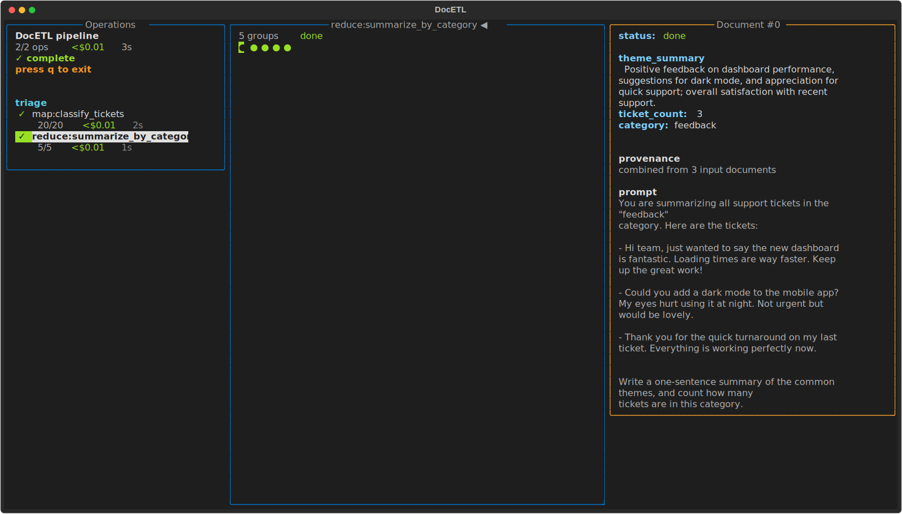
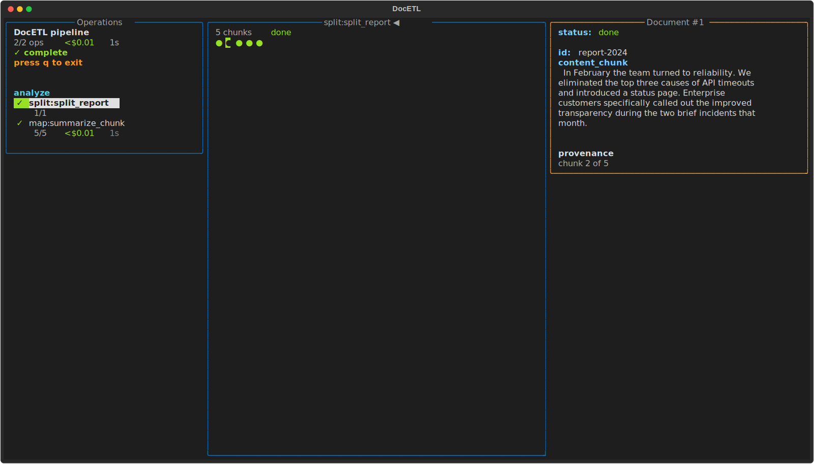
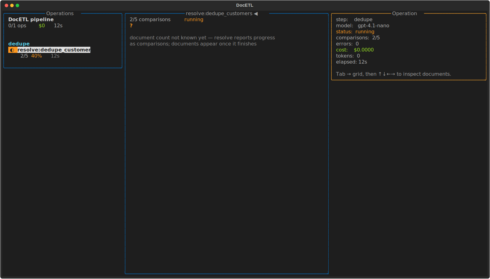
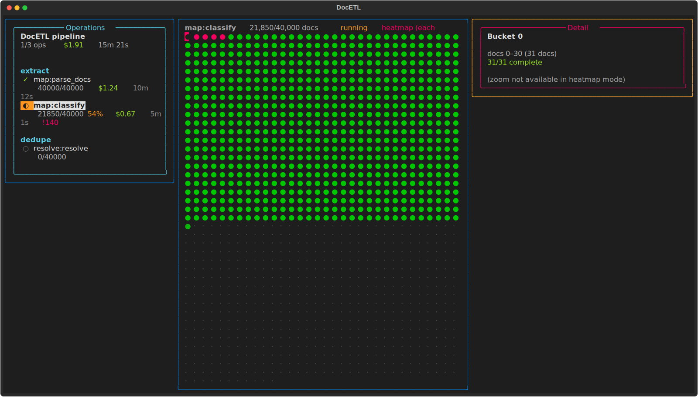

# Interactive Progress View

DocETL can show a full-screen, live progress dashboard in your terminal while a
pipeline runs: per-operation cost and timing, per-document status, and the
output and prompt of any finished document.


## Turning it on

Install the optional `tui` extra (which pulls in
[Textual](https://textual.textualize.io/)):

```bash
pip install "docetl[tui]"
```

Then add `interactive_ui: true` at the top level of your config (next to
`default_model`):

=== "YAML"

    ```yaml
    default_model: gpt-4.1-nano
    interactive_ui: true

    pipeline:
      steps:
        - name: themes
          input: reviews
          operations:
            - extract_theme
            - canonicalize_themes
            - summarize_themes
      output:
        type: file
        path: output.json
    ```

=== "Python"

    ```python
    # The interactive dashboard is a CLI feature: it starts when `docetl run`
    # finds `interactive_ui: true` in the YAML config. Pipelines executed
    # through the Python Frame API (.collect(), .show(), .write_json()) use
    # the standard log output instead.
    #
    # To use the dashboard for a pipeline built in Python, export it to YAML,
    # add `interactive_ui: true` at the top level, and run it with the CLI:

    pipeline.to_yaml("pipeline.yaml")
    # then: docetl run pipeline.yaml
    ```

And run the pipeline the usual way:

```bash
docetl run pipeline.yaml
```

The dashboard only starts in an interactive terminal. In a script, a CI job, or
anywhere the output is piped, DocETL falls back to its normal log output, so
the flag is safe to leave on.

## What you see

There are three panels:

- **Left — operations.** Every step and operation, with live status, counts,
  cost, and elapsed time. Total cost and time for the run are at the top.
- **Middle — documents.** One circle per document for the selected operation. A
  filled circle is done (green), in progress (orange), or errored (red); a
  hollow circle has not started. The header shows the operation's progress.
- **Right — detail.** The output of the document under the cursor, the prompt
  that produced it, and a note about where it came from. Documents appear here
  as soon as they finish, while the run is still going.

## Moving around

| Key | Action |
| --- | --- |
| `↑` / `↓` | select an operation |
| `Tab` | switch between the operations list and the document grid |
| `←` / `→` | move the cursor in the grid (and page through large grids) |
| `PgUp` / `PgDn` | page through the grid |
| `Enter` | inspect the document under the cursor |
| `q` | quit (the run keeps going) |

## What each kind of operation shows

The progress bar counts the unit of work for each operation, and the detail
panel notes where a document came from.

**Reduce** counts groups, and a group shows how many documents were combined into
it:



**Split** counts chunks, and a chunk shows which piece of its source document it
is (for example, "chunk 2 of 5"):



**Resolve** and **equijoin** count comparisons as they are made. Their output
documents aren't known until the operation finishes, so while it runs the header
counts comparisons and the grid shows a `?`:



## Very large runs

For runs with tens of thousands of documents, the grid switches to a heatmap:
each cell stands for a bucket of documents, shaded by how many are done. Live
counts and per-operation totals still update.


