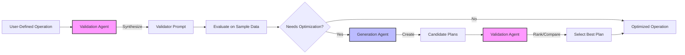

# Optimizing Pipelines

After creating your initial map-reduce pipeline, you might want to optimize it for better performance or to automatically add resolve operations. The DocETL pipeline optimizer is designed to help you achieve this.

## Understanding the Optimizer

The optimizer in DocETL finds optimal plans for operations marked with `optimize: True`. It can also insert resolve operations before reduce operations if needed. The optimizer uses GPT-4 under the hood (requiring an OpenAI API key) and can be customized with different models like gpt-4-turbo or gpt-4o-mini. Note that only LLM-powered operations can be optimized (e.g., `map`, `reduce`, `resolve`, `filter`, `equijoin`), but the optimized plans may involve new non-LLM operations (e.g., `split`).

At its core, the optimizer employs two types of AI agents: generation agents and validation agents. Generation agents work to rewrite operators into better plans, potentially decomposing a single operation into multiple, more efficient steps. Validation agents then evaluate these candidate plans, synthesizing task-specific validation prompts to compare outputs and determine the best plan for each operator.

<div class="mermaid-wrapper" style="display: flex; justify-content: center;">
  <div class="mermaid" style="width: 100%; height: auto;">

  </div>
</div>

!!! note "Optimizer Stability"

    The optimization process can be unstable, as well as resource-intensive (we've seen it take up to 10 minutes to optimize a single operation, spending up to ~$50 in API costs for end-to-end pipelines). We recommend optimizing one operation at a time and retrying if necessary, as results may vary between runs. This approach also allows you to confidently verify that each optimized operation is performing as expected before moving on to the next. See the [API](#optimizer-api) for more details on how to resume the optimizer from a failed run, by rerunning `docetl build pipeline.yaml --resume` (with the `--resume` flag).

## Should I Use the Optimizer?

While any pipeline can potentially benefit from optimization, there are specific scenarios where using the optimizer can significantly improve your pipeline's performance and accuracy. When should you use the optimizer?

!!! info "Large Documents"

    If you have documents that approach or exceed context limits and a map operation that transforms these documents using an LLM, the optimizer can help:

    - Improve accuracy
    - Enable processing of entire documents
    - Optimize for large-scale data handling

!!! info "Entity Resolution"
The optimizer is particularly useful when:

    - You need a resolve operation before your reduce operation
    - You've defined a resolve operation but want to optimize it for speed using blocking

!!! info "High-Volume Reduce Operations"
Consider using the optimizer when:

    - You have many documents feeding into a reduce operation for a given key
    - You're concerned about the accuracy of the reduce operation due to high volume
    - You want to optimize for better accuracy in complex reductions

Even if your pipeline doesn't fall into these specific categories, optimization can still be beneficial. For example, the optimizer can enhance your operations by adding gleaning to an operation, which uses an LLM-powered validator to ensure operation correctness. [Learn more about gleaning](../concepts/operators.md).

## Optimization Process

To optimize your pipeline, start with your initial configuration and follow these steps:

1. Set `optimize: True` for the operation you want to optimize (start with the first operation, if you're not sure which one).

2. Run the optimizer using the command `docetl build pipeline.yaml`. This will generate an optimized version in `pipeline_opt.yaml`.

3. Review the optimized operation in `pipeline_opt.yaml`. If you're satisfied with the changes, copy the optimized operation back into your original `pipeline.yaml`.

4. Move on to the next LLM-powered operation and repeat steps 1-3.

5. Once all operations are optimized, your `pipeline.yaml` will contain the fully optimized pipeline.

When optimizing a resolve operation, the optimizer will also set blocking configurations and thresholds, saving you from manual configuration.

!!! example "Feeling Ambitious?"

    You can run the optimizer on your entire pipeline by setting `optimize: True` for each operation you want to optimize. But sometimes the agent fails to find a better plan, and you'll need to manually intervene. We are exploring human-in-the-loop optimization, where the optimizer can ask for human feedback to improve its plans.

## Example: Optimizing a Medical Transcripts Pipeline

Let's walk through optimizing a pipeline for extracting medication information from medical transcripts. We'll start with an initial pipeline and optimize it step by step.

### Initial Pipeline

```yaml
datasets:
  transcripts:
    path: medical_transcripts.json
    type: file

default_model: gpt-4o-mini

operations:
  - name: extract_medications
    type: map
    output:
      schema:
        medication: list[str]
    prompt: |
      Analyze the transcript: {{ input.src }}
      List all medications mentioned.

  - name: unnest_medications
    type: unnest
    unnest_key: medication

  - name: summarize_prescriptions
    type: reduce
    reduce_key:
      - medication
    output:
      schema:
        side_effects: str
        uses: str
    prompt: |
      Summarize side effects and uses of {{ reduce_key }} from:
      
      Transcript {{ loop.index }}: {{ value.src }}
      

pipeline:
  output:
    path: medication_summaries.json
    type: file
  steps:
    - input: transcripts
      name: medical_info_extraction
      operations:
        - extract_medications
        - unnest_medications
        - summarize_prescriptions
```

### Optimization Steps

First, we'll optimize the `extract_medications` operation. Set `optimize: True` for this operation and run the optimizer. Review the changes and integrate them into your pipeline.

Then, optimize the `summarize_prescriptions` operation by setting `optimize: True` and running `docetl build pipeline.yaml` again. The optimizer may suggest adding a resolve operation at this point, and will automatically configure blocking and thresholds. After completing all steps, your optimized pipeline might look like this:

### Optimized Pipeline

```yaml
datasets:
  transcripts:
    path: medical_transcripts.json
    type: file

default_model: gpt-4o-mini

operations:
  - name: extract_medications
    type: map
    output:
      schema:
        medication: list[str]
    prompt: |
      Analyze the transcript: {{ input.src }}
      List all medications mentioned.
    gleaning:
      num_rounds: 1
      validation_prompt: |
        Evaluate the extraction for completeness and accuracy:
        1. Are all medications, dosages, and symptoms from the transcript included?
        2. Is the extracted information correct and relevant?

  - name: unnest_medications
    type: unnest
    unnest_key: medication

  - name: resolve_medications
    type: resolve
    blocking_keys:
      - medication
    blocking_threshold: 0.7
    comparison_prompt: |
      Compare medications:
      1: {{ input1.medication }}
      2: {{ input2.medication }}
      Are these the same or closely related?
    resolution_prompt: |
      Standardize the name for:
      
      - {{ entry.medication }}
      

  - name: summarize_prescriptions
    type: reduce
    reduce_key:
      - medication
    output:
      schema:
        side_effects: str
        uses: str
    prompt: |
      Summarize side effects and uses of {{ reduce_key }} from:
      
      Transcript {{ loop.index }}: {{ value.src }}
      
    fold_batch_size: 10
    fold_prompt: |
      Update the existing summary of side effects and uses for {{ reduce_key }} based on the following additional transcripts:
      
      Transcript {{ loop.index }}: {{ value.src }}
      

      Existing summary:
      Side effects: {{ output.side_effects }}
      Uses: {{ output.uses }}

      Provide an updated and comprehensive summary, incorporating both the existing information and any new insights from the additional transcripts.

pipeline:
  output:
    path: medication_summaries.json
    type: file
  steps:
    - input: transcripts
      name: medical_info_extraction
      operations:
        - extract_medications
        - unnest_medications
        - resolve_medications
        - summarize_prescriptions
```

This optimized pipeline now includes improved prompts, a resolve operation, and additional output fields for more comprehensive medication information extraction.

!!! tip "Feedback Welcome"

    We're continually improving the optimizer. Your feedback on its performance and usability is invaluable. Please share your experiences and suggestions!

## Advanced: Customizing Optimization

You can customize the optimization process for specific operations using the ``optimizer_config in your pipeline.

### Global Configuration

The following options can be applied globally to all operations in your pipeline during optimization:

- `num_retries`: The number of times to retry optimizing if the LLM agent fails. Default is 1.

- `sample_sizes`: Override the default sample sizes for each operator type. Specify as a dictionary with operator types as keys and integer sample sizes as values.

  Default sample sizes:

  ```python
  SAMPLE_SIZE_MAP = {
      "reduce": 40,
      "map": 5,
      "resolve": 100,
      "equijoin": 100,
      "filter": 5,
  }
  ```

### Equijoin Configuration

- `target_recall`: Change the default target recall (default is 0.95).

### Resolve Configuration

- `target_recall`: Specify the target recall for the resolve operation.

### Reduce Configuration

- `synthesize_resolve`: Set to `False` if you definitely don't want a resolve operation synthesized or want to turn off this rewrite rule.

### Map Configuration

- `force_chunking_plan`: Set to `True` if you want the the optimizer to force plan that breaks up the input documents into chunks.

### Example Configuration

Here's an example of how to use the `optimizer_config` in your pipeline:

```yaml
optimizer_config:
  num_retries: 2
  sample_sizes:
    map: 10
    reduce: 50
  reduce:
    synthesize_resolve: false
  map:
    force_chunking_plan: true

operations:
  - name: extract_medications
    type: map
    optimize: true
    # ... other configuration ...

  - name: summarize_prescriptions
    type: reduce
    optimize: true
    # ... other configuration ...
# ... rest of the pipeline configuration ...
```

This configuration will:

1. Retry optimization up to 2 times for each operation if the LLM agent fails.
2. Use custom sample sizes for map (10) and reduce (50) operations.
3. Prevent the synthesis of resolve operations for reduce operations.
4. Force a chunking plan for map operations.

## Optimizer API

::: docetl.cli.build
handler: python
options:
members: - build
show_root_full_path: true
show_root_toc_entry: true
show_root_heading: true
show_source: false
show_name: true
