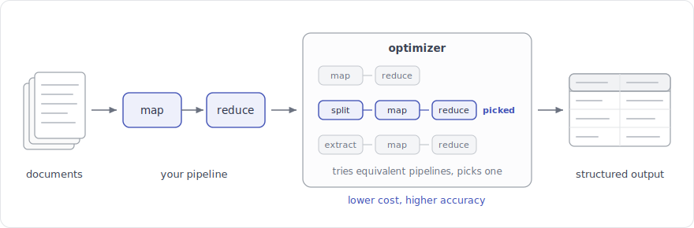

# DocETL { .center-title }

<p align="center">
<a href="https://github.com/ucbepic/docetl"></a>
<a href="https://docetl.org"></a>
<a href="https://ucbepic.github.io/docetl"></a>
<a href="https://discord.gg/fHp7B2X3xx"></a>
<a href="https://arxiv.org/abs/2410.12189"></a>
</p>

<p align="center"></p>

DocETL is a declarative query engine and optimizer for LLM-powered data
processing. Think of DocETL as an agentic map-reduce framework. It provides

- high-level operations (map, reduce, filter, resolve, extract) that you
  author in natural language and agents execute,
- structured, relational outputs (every operation declares a typed schema,
  so results land as tables you can query), and
- an optimizer that rewrites pipelines to be high-accuracy and
  cost-efficient, searching over models, prompts, and operation
  decompositions.


Use it when you have a task over a collection of documents or unstructured
records, e.g. extracting and aggregating themes across thousands of
transcripts, and you care about output quality, cost, or both.

## Getting Started

Write pipelines in Python, or in YAML if you prefer low-code / no-code. (There is also a [pandas accessor](pandas/index.md) for quick one-off operations on DataFrames.)

=== "Python"

    ```python
    import docetl

    docetl.default_model = "gpt-4o-mini"

    # What themes come up across customer interviews?
    interviews = docetl.read_json("interviews.json")

    # Extract themes from each interview
    interviews = interviews.map(
        prompt="List the themes discussed in this interview: {{ input.transcript }}",
        output={"schema": {"themes": "list[str]"}},
    )

    # Synthesize the top themes across all interviews
    themes = interviews.reduce(
        reduce_key="_all",
        prompt="""Identify the top recurring themes across these interviews:
    - {{ item.themes }}
    """,
        output={"schema": {"top_themes": "list[{name: str, description: str, num_mentions: int}]"}},
    )

    df = themes.collect()  # nothing runs until this line
    ```

    `df` is a pandas DataFrame; `df["top_themes"][0]` looks like:

    ```python
    [
        {"name": "onboarding friction", "description": "confusion during first-week setup", "num_mentions": 12},
        {"name": "pricing transparency", "description": "unclear billing and plan limits", "num_mentions": 8},
        ...
    ]
    ```

    See the [User Guide](concepts/pipelines.md) for details.

=== "YAML"

    Define the same pipeline declaratively, then run it from the CLI:

    ```yaml
    default_model: gpt-4o-mini
    datasets:
      interviews:
        type: file
        path: interviews.json
    operations:
      - name: extract_themes
        type: map
        prompt: "List the themes discussed in this interview: {{ input.transcript }}"
        output:
          schema:
            themes: list[str]
      - name: synthesize_themes
        type: reduce
        reduce_key: _all
        prompt: |
          Identify the top recurring themes across these interviews:
          - {{ item.themes }}
          
        output:
          schema:
            top_themes: "list[{name: str, description: str, num_mentions: int}]"
    pipeline:
      steps:
        - name: analyze
          input: interviews
          operations: [extract_themes, synthesize_themes]
      output:
        type: file
        path: themes.json
    ```

    ```bash
    docetl run pipeline.yaml
    ```

    See the [tutorial](tutorial.md) for a complete walkthrough.

## Project Origin

DocETL was created by members of the EPIC Data Lab and Data Systems and Foundations group at UC Berkeley. The EPIC (Effective Programming, Interaction, and Computation with Data) Lab focuses on developing low-code and no-code interfaces for data work, powered by next-generation predictive programming techniques. DocETL is one of the projects that emerged from our research efforts to streamline complex document processing tasks.

For more information about the labs and other projects, visit the [EPIC Lab webpage](https://epic.berkeley.edu/) and the [Data Systems and Foundations webpage](https://dsf.berkeley.edu/).
