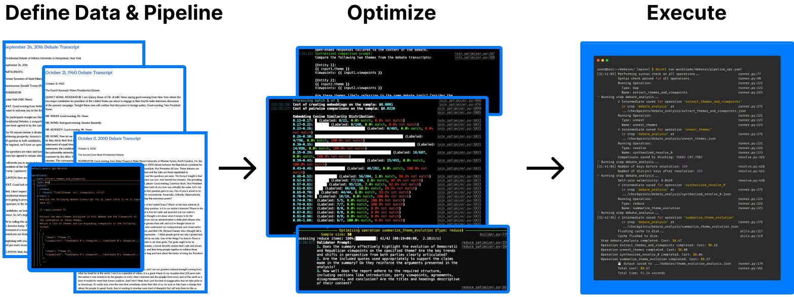

# DocETL: A System for Complex Document Processing

[](https://github.com/ucbepic/docetl)
[](https://docetl.org)
[](https://ucbepic.github.io/docetl)
[](https://discord.gg/fHp7B2X3xx)
[](https://arxiv.org/abs/2410.12189)



DocETL is a tool for creating and executing LLM-powered data processing pipelines. It offers a low-code, declarative YAML interface to define complex data operations on complex data.

!!! tip "When to Use DocETL"

    DocETL is the ideal choice when you're looking to **maximize correctness and output quality** for complex tasks over a collection of documents or unstructured datasets. You should consider using DocETL if:

    - You have complex tasks that you want to represent via map-reduce (e.g., map over your documents, then group by the result of your map call & reduce)
    - You're unsure how to best write your pipeline or sequence of operations to maximize LLM accuracy
    - You're working with long documents that don't fit into a single prompt or are too lengthy for effective LLM reasoning
    - You have validation criteria and want tasks to automatically retry when the validation fails

## Features

- **Rich Suite of Operators**: Tailored for complex data processing, including specialized operators like "resolve" for entity resolution and "gather" for maintaining context when splitting documents.
- **Low-Code Interface**: Define your pipeline and prompts easily using YAML. You have 100% control over the prompts.
- **Flexible Processing**: Handle various document types and processing tasks across domains like law, medicine, and social sciences.
- **Accuracy Optimization**: Our optimizer leverages LLM agents to experiment with different logically-equivalent rewrites of your pipeline and automatically selects the most accurate version. This includes finding limits of how many documents to process in a single reduce operation before the accuracy plateaus.

## Getting Started

DocETL supports two ways to define pipelines:

### Python API (recommended)

```python
import docetl

docetl.default_model = "gpt-4o-mini"

results = (
    docetl.read_json("input.json")
    .map(prompt="Classify: {{ input.text }}", output={"schema": {"category": "str"}})
    .reduce(reduce_key="category", prompt="Summarize: {{ inputs }}", output={"schema": {"summary": "str"}})
    .collect()
)
```

See the [Python API guide](python/index.md) for the full reference.

### YAML (low-code)

Define your pipeline declaratively, then run it from the CLI:

```yaml
default_model: gpt-4o-mini
datasets:
  docs:
    type: file
    path: input.json
operations:
  - name: classify
    type: map
    prompt: "Classify: {{ input.text }}"
    output:
      schema:
        category: str
pipeline:
  steps:
    - name: step1
      input: docs
      operations: [classify]
  output:
    type: file
    path: output.json
```

```bash
docetl run pipeline.yaml
```

See the [YAML tutorial](tutorial.md) for a complete walkthrough.

### Pandas Integration

For quick exploration on existing DataFrames, use the `.semantic` accessor:

```python
df.semantic.map(prompt="...", output={"schema": {"field": "str"}})
```

See the [Pandas integration guide](pandas/index.md) for details.

!!! tip "Fastest Way: Claude Code"
    Clone this repo and run `claude` to use the built-in DocETL skill. Just describe your data processing task and Claude will create and run the pipeline for you. See [Quick Start (Claude Code)](quickstart-claude-code.md) for details.

## Project Origin

DocETL was created by members of the EPIC Data Lab and Data Systems and Foundations group at UC Berkeley. The EPIC (Effective Programming, Interaction, and Computation with Data) Lab focuses on developing low-code and no-code interfaces for data work, powered by next-generation predictive programming techniques. DocETL is one of the projects that emerged from our research efforts to streamline complex document processing tasks.

For more information about the labs and other projects, visit the [EPIC Lab webpage](https://epic.berkeley.edu/) and the [Data Systems and Foundations webpage](https://dsf.berkeley.edu/).
