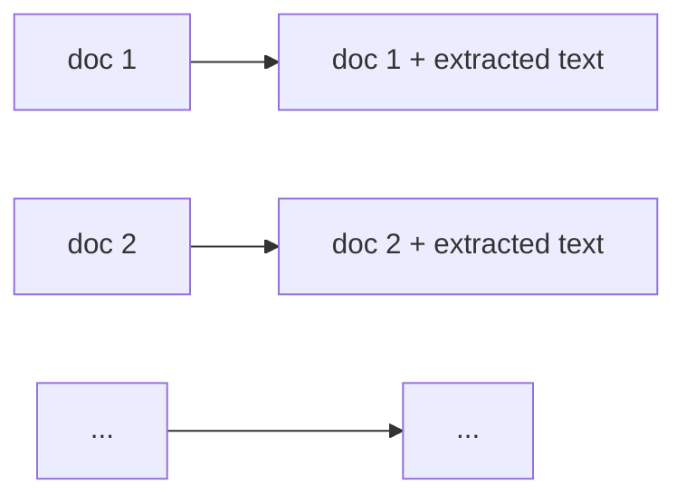

# Extract Operation

!!! tip "Why use Extract instead of Map?"

    Extract pulls out sections of source text verbatim, without synthesis or summarization. Compared to Map:

    1. **Cost efficiency**: Lower output token costs when extracting large chunks of text
    2. **Precision**: Exact text, without LLM interpretation or potential hallucination
    3. **Simplified workflow**: No output schema needed - extractions keep the original text format


The Extract operation pulls specific sections of text from documents based on provided criteria.

## Example: Extracting Key Findings from Research Reports

=== "YAML"

    ```yaml
    - name: findings
      type: extract
      prompt: |
        Extract all sections that discuss key findings, results, or conclusions from this research report.
        Focus on paragraphs that:
        - Summarize experimental outcomes
        - Present statistical results
        - Describe discovered insights
        - State conclusions drawn from the research
        
        Only extract the most important and substantive findings.
      document_keys: ["report_text"]
      model: "gpt-4.1-mini"
    ```

=== "Python"

    ```python
    import docetl

    docetl.default_model = "gpt-4.1-mini"

    frame = docetl.read_json("reports.json")
    frame = frame.extract(
        prompt="""Extract all sections that discuss key findings, results, or conclusions from this research report.
    Focus on paragraphs that:
    - Summarize experimental outcomes
    - Present statistical results
    - Describe discovered insights
    - State conclusions drawn from the research

    Only extract the most important and substantive findings.""",
        document_keys=["report_text"],
        model="gpt-4.1-mini",
    )
    rows = frame.collect()
    ```

This operation converts text into a line-numbered format, uses an LLM to identify relevant content, and extracts the specified text ranges. The extracted content is added to the document with the suffix "_extracted_findings".

??? example "Sample Input and Output"

    Input:
    ```json
    [
      {
        "report_id": "R-2023-001",
        "report_text": "EXPERIMENTAL METHODS\n\nThe study utilized a mixed-methods approach combining quantitative surveys (n=230) and qualitative interviews (n=42) with participants from diverse demographic backgrounds. Data collection occurred between January and March 2023.\n\nRESULTS\n\nThe analysis revealed three primary patterns of user engagement. First, 68% of participants reported daily interaction with the platform, significantly higher than previous industry benchmarks (p<0.01). Second, user retention showed strong correlation with personalization features (r=0.72). Finally, demographic factors such as age and technical proficiency were not significant predictors of engagement, contradicting prior research in this domain.\n\nDISCUSSION\n\nThese findings suggest that platform design priorities should emphasize personalization capabilities over demographic targeting. The high daily engagement rates indicate market readiness for similar applications, while the lack of demographic effects points to broad accessibility across user segments.\n\nLIMITATIONS\n\nThe study was limited by its focus on early adopters, which may not represent the broader potential user base. Additionally, the three-month timeframe may not capture seasonal variations in user behavior."
      }
    ]
    ```

    Output:
    ```json
    [
      {
        "report_id": "R-2023-001",
        "report_text": "EXPERIMENTAL METHODS\n\nThe study utilized a mixed-methods approach combining quantitative surveys (n=230) and qualitative interviews (n=42) with participants from diverse demographic backgrounds. Data collection occurred between January and March 2023.\n\nRESULTS\n\nThe analysis revealed three primary patterns of user engagement. First, 68% of participants reported daily interaction with the platform, significantly higher than previous industry benchmarks (p<0.01). Second, user retention showed strong correlation with personalization features (r=0.72). Finally, demographic factors such as age and technical proficiency were not significant predictors of engagement, contradicting prior research in this domain.\n\nDISCUSSION\n\nThese findings suggest that platform design priorities should emphasize personalization capabilities over demographic targeting. The high daily engagement rates indicate market readiness for similar applications, while the lack of demographic effects points to broad accessibility across user segments.\n\nLIMITATIONS\n\nThe study was limited by its focus on early adopters, which may not represent the broader potential user base. Additionally, the three-month timeframe may not capture seasonal variations in user behavior.",
        "report_text_extracted_findings": "The analysis revealed three primary patterns of user engagement. First, 68% of participants reported daily interaction with the platform, significantly higher than previous industry benchmarks (p<0.01). Second, user retention showed strong correlation with personalization features (r=0.72). Finally, demographic factors such as age and technical proficiency were not significant predictors of engagement, contradicting prior research in this domain.\n\nThese findings suggest that platform design priorities should emphasize personalization capabilities over demographic targeting. The high daily engagement rates indicate market readiness for similar applications, while the lack of demographic effects points to broad accessibility across user segments."
      }
    ]
    ```

## Output Formats

The Extract operation offers two output formats controlled by the `format_extraction` parameter:

### String Format (Default)

With `format_extraction: true`, extracted text segments are joined with newlines into a single string:

=== "YAML"

    ```yaml
    - name: findings
      type: extract
      prompt: "Extract the key findings from this research report."
      document_keys: ["report_text"]
      format_extraction: true  # Default setting
    ```

=== "Python"

    ```python
    frame = frame.extract(
        name="findings",
        prompt="Extract the key findings from this research report.",
        document_keys=["report_text"],
        format_extraction=True,  # Default setting
    )
    ```

The resulting output combines all extractions:

```json
{
  "report_id": "R-2023-001",
  "report_text": "... original text ...",
  "report_text_extracted_findings": "Finding 1 about daily engagement rates...\n\nFinding 2 about personalization features..."
}
```

Use this format when the extractions should be treated as a coherent unit.

### List Format

With `format_extraction: false`, each extracted text segment remains separate in a list:

=== "YAML"

    ```yaml
    - name: findings
      type: extract
      prompt: "Extract the key findings from this research report."
      document_keys: ["report_text"]
      format_extraction: false
    ```

=== "Python"

    ```python
    frame = frame.extract(
        name="findings",
        prompt="Extract the key findings from this research report.",
        document_keys=["report_text"],
        format_extraction=False,
    )
    ```

The resulting output preserves each extraction as a distinct item:

```json
{
  "report_id": "R-2023-001",
  "report_text": "... original text ...",
  "report_text_extracted_findings": [
    "Finding 1 about daily engagement rates...",
    "Finding 2 about personalization features..."
  ]
}
```

Use this format when each extraction needs individual processing, counting, or structuring.

## Extraction Strategies

### Line Number Strategy

Reformats the input text with line numbers, asks the LLM to identify relevant line ranges, then extracts those ranges, removes line number prefixes, and eliminates duplicates. Works well for multi-line passages or entire sections.

### Regex Strategy

Asks the LLM to generate regex patterns matching the desired content, then applies them to the original text. Works well for structured data like dates, codes, or specific formatted information.

## Required Parameters

- `name`: Unique name for the operation
- `type`: Must be "extract"
- `prompt`: Instructions specifying what content to extract. This does **not** need to be a Jinja template.
- `document_keys`: List of document fields containing text to process

## Optional Parameters

| Parameter | Description | Default |
| --------- | ----------- | ------- |
| `model` | Language model to use | Falls back to `default_model` |
| `extraction_method` | "line_number" or "regex" | "line_number" |
| `format_extraction` | Join with newlines (`true`) or keep as list (`false`) | `true` |
| `extraction_key_suffix` | Suffix for output field names | "_extracted_{name}" |
| `timeout` | Timeout for LLM calls in seconds | 120 |
| `skip_on_error` | Continue processing if errors occur | false |
| `litellm_completion_kwargs` | Additional parameters for LiteLLM calls | {} |
| `limit` | Maximum number of documents to extract from before stopping | Processes all data |
| `retriever` | Name of a retriever to use for RAG. See [Retrievers](../retrievers.md). | None |
| `save_retriever_output` | If true, saves the retrieved context to `_<operation_name>_retrieved_context` in the output. | False |

When `limit` is set, Extract only reformats and submits the first _N_ documents — useful for capping cost while previewing results on a large dataset.

## Best Practices

- Use `line_number` for paragraphs, sections, or content spanning multiple lines; use `regex` for specific patterns like dates, codes, or formatted data.
- Include only document fields containing relevant text in `document_keys`.
- Enable `skip_on_error` for batch processing where individual failures shouldn't halt the operation.
- Use the default string format when extractions form a coherent whole; use the list format when each extraction needs individual processing.