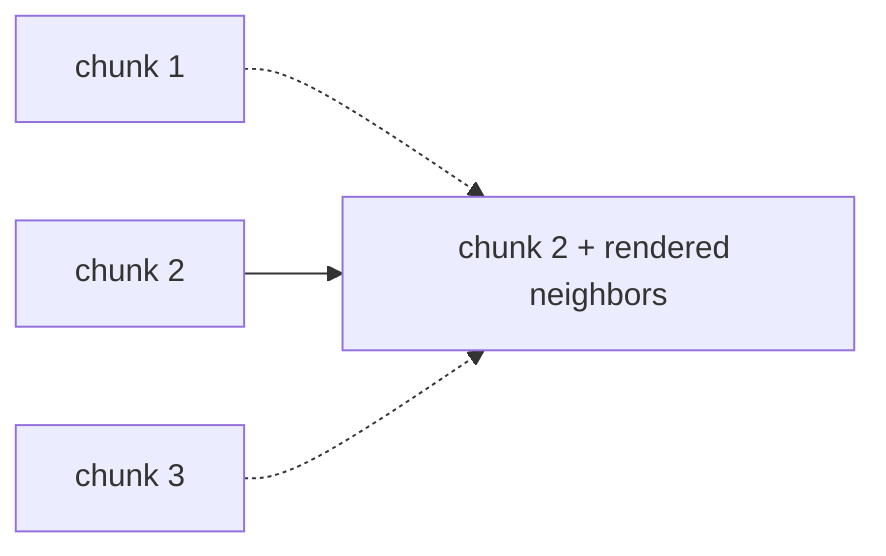
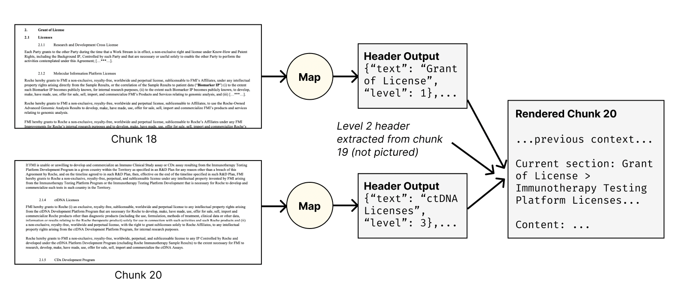

# Gather Operation

The Gather operation complements Split by adding context from surrounding chunks to each chunk. Split chunks often lack context on their own — e.g., a merger agreement chunk may reference "the Company" or "Effective Date" defined in earlier chunks.



## How Gather Works

1. Identifies relevant surrounding chunks (peripheral context): preceding/following text, or summarized versions of nearby chunks
2. Adds this context to each chunk
3. Preserves document structure via header hierarchies (see `doc_header_key`)

## Example: Enhancing Context in Legal Document Analysis

This example processes a long merger agreement.

### Step 1: Extract Metadata (Map operation before splitting)

First, we extract important metadata from the full document:

=== "YAML"

    ```yaml
    - name: extract_metadata
      type: map
      prompt: |
        Extract the following metadata from the merger agreement:
        1. Agreement Date
        2. Parties involved
        3. Total value of the merger (if specified)

        Agreement text:
        {{ input.agreement_text }}

        Return the extracted information in a structured format.
      output:
        schema:
          agreement_date: string
          parties: list[string]
          merger_value: string
    ```

=== "Python"

    ```python
    import docetl

    docetl.default_model = "gpt-4o-mini"

    frame = docetl.read_json("agreements.json")
    frame = frame.map(
        name="extract_metadata",
        prompt="""Extract the following metadata from the merger agreement:
    1. Agreement Date
    2. Parties involved
    3. Total value of the merger (if specified)

    Agreement text:
    {{ input.agreement_text }}

    Return the extracted information in a structured format.""",
        output={
            "schema": {
                "agreement_date": "string",
                "parties": "list[string]",
                "merger_value": "string",
            }
        },
    )
    ```

### Step 2: Split Operation

Next, we split the document into manageable chunks:

=== "YAML"

    ```yaml
    - name: split_merger_agreement
      type: split
      split_key: agreement_text
      method: token_count
      method_kwargs:
        num_tokens: 1000
    ```

=== "Python"

    ```python
    frame = frame.split(
        name="split_merger_agreement",
        split_key="agreement_text",
        method="token_count",
        method_kwargs={"num_tokens": 1000},
    )
    ```

### Step 3: Extract Headers (Map operation)

We extract headers from each chunk:

=== "YAML"

    ```yaml
    - name: extract_headers
      type: map
      input:
        - agreement_text_chunk
      prompt: |
        Extract any section headers from the following merger agreement chunk:
        {{ input.agreement_text_chunk }}
        Return the headers as a list, preserving their hierarchy.
      output:
        schema:
          headers: "list[{header: string, level: integer}]"
    ```

=== "Python"

    ```python
    frame = frame.map(
        name="extract_headers",
        input=["agreement_text_chunk"],
        prompt="""Extract any section headers from the following merger agreement chunk:
    {{ input.agreement_text_chunk }}
    Return the headers as a list, preserving their hierarchy.""",
        output={"schema": {"headers": "list[{header: string, level: integer}]"}},
    )
    ```

### Step 4: Gather Operation

Now, we apply the Gather operation:

=== "YAML"

    ```yaml
    - name: context_gatherer
      type: gather
      content_key: agreement_text_chunk
      doc_id_key: split_merger_agreement_id
      order_key: split_merger_agreement_chunk_num
      peripheral_chunks:
        previous:
          middle:
            content_key: agreement_text_chunk_summary
          tail:
            content_key: agreement_text_chunk
        next:
          head:
            count: 1
            content_key: agreement_text_chunk
      doc_header_key: headers
    ```

=== "Python"

    ```python
    import docetl

    docetl.default_model = "gpt-4o-mini"

    frame = docetl.read_json("chunks.json")
    frame = frame.gather(
        content_key="agreement_text_chunk",
        doc_id_key="split_merger_agreement_id",
        order_key="split_merger_agreement_chunk_num",
        peripheral_chunks={
            "previous": {
                "middle": {"content_key": "agreement_text_chunk_summary"},
                "tail": {"content_key": "agreement_text_chunk"},
            },
            "next": {
                "head": {"count": 1, "content_key": "agreement_text_chunk"},
            },
        },
        doc_header_key="headers",
    )
    rows = frame.collect()
    ```

### Step 5: Analyze Chunks (Map operation after Gather)

Finally, we analyze each chunk with its gathered context:

=== "YAML"

    ```yaml
    - name: analyze_chunks
      type: map
      input:
        - agreement_text_chunk_rendered
        - agreement_date
        - parties
        - merger_value
      prompt: |
        Analyze the following chunk of a merger agreement, considering the provided metadata:

        Agreement Date: {{ input.agreement_date }}
        Parties: {{ input.parties | join(', ') }}
        Merger Value: {{ input.merger_value }}

        Chunk content:
        {{ input.agreement_text_chunk_rendered }}

        Provide a summary of key points and any potential legal implications in this chunk.
      output:
        schema:
          summary: string
          legal_implications: list[string]
    ```

=== "Python"

    ```python
    frame = frame.map(
        name="analyze_chunks",
        input=[
            "agreement_text_chunk_rendered",
            "agreement_date",
            "parties",
            "merger_value",
        ],
        prompt="""Analyze the following chunk of a merger agreement, considering the provided metadata:

    Agreement Date: {{ input.agreement_date }}
    Parties: {{ input.parties | join(', ') }}
    Merger Value: {{ input.merger_value }}

    Chunk content:
    {{ input.agreement_text_chunk_rendered }}

    Provide a summary of key points and any potential legal implications in this chunk.""",
        output={
            "schema": {
                "summary": "string",
                "legal_implications": "list[string]",
            }
        },
    )
    rows = frame.collect()
    ```

The gather step in this pipeline includes, for each chunk:

- Summaries of the chunks before the previous chunk
- The full content of the previous chunk
- The full content of the next chunk
- Extracted headers for levels directly above headers in the current chunk, for structural context

## Configuration

The Gather operation includes several key components:

- `type`: Always set to "gather"
- `doc_id_key`: Identifies chunks from the same original document
- `order_key`: Specifies the sequence of chunks within a group
- `content_key`: Indicates the field containing the chunk content
- `peripheral_chunks`: Specifies how to include context from surrounding chunks
- `doc_header_key` (optional): Denotes a field representing extracted headers for each chunk
- `sample` (optional): Number of samples to use for the operation

### Peripheral Chunks Configuration

The `peripheral_chunks` configuration determines which surrounding chunks are included and how they are presented.

#### Structure

It is divided into two main sections:

1. `previous`: Defines how chunks preceding the current chunk are included.
2. `next`: Defines how chunks following the current chunk are included.

Each of these sections can contain up to three subsections:

- `head`: The first chunk(s) in the section.
- `middle`: Chunks between the `head` and `tail` sections.
- `tail`: The last chunk(s) in the section.

#### Configuration Options

For each subsection, you can specify:

- `count`: The number of chunks to include (for `head` and `tail` only).
- `content_key`: The key in the chunk data that contains the content to use.

#### Example Configuration

=== "YAML"

    ```yaml
    peripheral_chunks:
      previous:
        head:
          count: 1
          content_key: full_content
        middle:
          content_key: summary_content
        tail:
          count: 2
          content_key: full_content
      next:
        head:
          count: 1
          content_key: full_content
    ```

=== "Python"

    ```python
    # Pass via the peripheral_chunks= kwarg on a gather call
    peripheral_chunks={
        "previous": {
            "head": {"count": 1, "content_key": "full_content"},
            "middle": {"content_key": "summary_content"},
            "tail": {"count": 2, "content_key": "full_content"},
        },
        "next": {
            "head": {"count": 1, "content_key": "full_content"},
        },
    }
    ```

This configuration would:

1. Include the full content of the very first chunk.
2. Include summaries of all chunks between the `head` and `tail` of the previous section.
3. Include the full content of 2 chunks immediately before the current chunk.
4. Include the full content of 1 chunk immediately after the current chunk.

#### Behavior Details

1. **Content Selection**:
   If a `content_key` is specified that's different from the main content key, it's treated as a summary. This is useful for including condensed versions of chunks in the `middle` section to save space. If no `content_key` is specified, it defaults to the main content key of the operation.

2. **Chunk Ordering**:
   For the `previous` section, chunks are processed in reverse order (from the current chunk towards the beginning of the document). For the `next` section, chunks are processed in forward order.

3. **Skipped Content**:
   If there are gaps between included chunks, the operation inserts a note indicating how many characters were skipped. Example: `[... 5000 characters skipped ...]`

4. **Chunk Labeling**:
   Each included chunk is labeled with its order number and whether it's a summary. Example: `[Chunk 5 (Summary)]` or `[Chunk 6]`

### Best Practices

1. **Balance Context and Conciseness**: Use full content for immediate context (`head`/`tail`) and summaries for `middle` sections.

2. **Adapt to Document Structure**: Adjust the `count` for `head` and `tail` based on the typical length of your document sections.

3. **Use Asymmetric Configurations**: Many tasks need more previous context than next context, or vice versa.

4. **Consider Cost**: More context means more tokens; use summaries and selective inclusion.

## Output

The Gather operation adds a new field to each input document, named by appending "\_rendered" to the `content_key`. This field contains:

1. The reconstructed header hierarchy (if applicable)
2. Previous context (if any)
3. The main chunk, clearly marked
4. Next context (if any)
5. Indications of skipped content between contexts

!!! example "Sample Output for Merger Agreement"

    ```yaml
    agreement_text_chunk_rendered: |
      _Current Section:_ # Article 5: Representations and Warranties > ## 5.1 Representations and Warranties of the Company

      --- Previous Context ---
      [Chunk 17] ... summary of earlier sections on definitions and parties ...
      [... 500 characters skipped ...]
      [Chunk 18] The Company hereby represents and warrants to Parent and Merger Sub as follows, except as set forth in the Company Disclosure Schedule:
      --- End Previous Context ---

      --- Begin Main Chunk ---
      5.1.1 Organization and Qualification. The Company is duly organized, validly existing, and in good standing under the laws of its jurisdiction of organization and has all requisite corporate power and authority to own, lease, and operate its properties and to carry on its business as it is now being conducted...
      --- End Main Chunk ---

      --- Next Context ---
      [Chunk 20] 5.1.2 Authority Relative to This Agreement. The Company has all necessary corporate power and authority to execute and deliver this Agreement, to perform its obligations hereunder, and to consummate the Merger...
      [... 750 characters skipped ...]
      --- End Next Context ---
    ```

## Handling Document Structure

The Gather operation maintains document structure through header hierarchies.

### How Header Handling Works

1. Headers are typically extracted from each chunk using a Map operation after the Split but before the Gather.
2. The Gather operation uses these extracted headers to reconstruct the relevant header hierarchy for each chunk.
3. When rendering a chunk, the operation includes all the most recent headers from higher levels found in previous chunks.
4. This ensures that each rendered chunk includes a complete "path" of headers leading to its content, preserving the document's overall structure and context.

### Example: Header Handling in Legal Contracts



In this figure:

1. We see two chunks (18 and 20) from a 74-page legal contract.
2. Each chunk goes through a Map operation to extract headers.
3. For Chunk 18, a level 1 header "Grant of License" is extracted.
4. For Chunk 20, a level 3 header "ctDNA Licenses" is extracted.
5. When rendering Chunk 20, the Gather operation includes:
   - The level 1 header from Chunk 18 ("Grant of License")
   - A level 2 header from Chunk 19 (not pictured, but included in the rendered output)
   - The current level 3 header from Chunk 20 ("ctDNA Licenses")

Chunk 20 thus gets its full header path even though the higher-level headers are not present in that chunk.

## Best Practices

1.  **Extract Metadata Before Splitting**: Run a map on the full document before splitting to extract metadata useful for every chunk (e.g., agreement dates, parties), and reference it in map operations after the gather step.

2.  **Balance Context and Efficiency**: For ultra-long documents, use summarized versions of chunks in the "middle" sections.

3.  **Preserve Document Structure**: Use `doc_header_key` to include structural information from the original document.

4.  **Tailor Context to Your Task**: Some tasks need more preceding context; others more following context.

5.  **Consider Cost**: Added context increases token counts; downstream operations must handle the larger inputs.

6.  **Use `next` Sparingly**: For most text documents, `prev` context is sufficient. Use `next` when the next chunk provides essential context — e.g., multi-page tables in financial reports, diagrams spanning pages, or clauses split across chunk boundaries.
