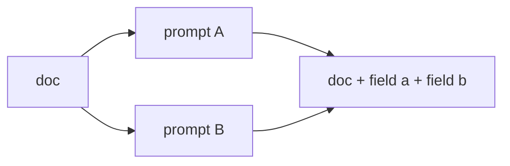

# Parallel Map Operation

The Parallel Map operation applies multiple independent transformations to each item concurrently, maintaining a 1:1 input-to-output ratio. It differs from Map in that you define multiple prompts that run concurrently, without explicitly creating a DAG.



## Configuration

- Each prompt generates specific fields of the output; prompts run concurrently.
- The output schema must include all fields generated by the individual prompts; results are combined into a single output item per input.

### Required Parameters

| Parameter | Description                                                |
| --------- | ---------------------------------------------------------- |
| `name`    | A unique name for the operation                            |
| `type`    | Must be set to "parallel_map"                              |
| `prompts` | A list of prompt configurations (see below)                |
| `output`  | Schema definition for the combined output from all prompts |

Each prompt configuration in the `prompts` list should contain:

- `prompt`: The prompt template to use for the transformation
- `output_keys`: List of keys that this prompt will generate
- `model` (optional): The language model to use for this specific prompt
- `gleaning` (optional): Advanced validation settings for this prompt (see Per-Prompt Gleaning section below)

### Optional Parameters

| Parameter                 | Description                                | Default                       |
| ------------------------- | ------------------------------------------ | ----------------------------- |
| `model`                   | The default language model to use          | Falls back to `default_model` |
| `optimize`                | Flag to enable operation optimization      | True                          |
| `recursively_optimize`    | Flag to enable recursive optimization      | false                         |
| `sample`             | Number of samples to use for the operation | Processes all data            |
| `timeout`                 | Timeout for each LLM call in seconds       | 120                           |
| `max_retries_per_timeout` | Maximum number of retries per timeout      | 2                             |
| `litellm_completion_kwargs` | Additional parameters to pass to LiteLLM completion calls. | {}                          |

??? question "Why use Parallel Map instead of multiple Map operations?"

    1. **Concurrency**: Prompts run in parallel.
    2. **Simplified Configuration**: Multiple transformations in a single operation.
    3. **Unified Output**: Results from all prompts are combined into a single output item.

## Example: Processing Job Applications

=== "YAML"

    ```yaml
    - name: process_job_application
      type: parallel_map
      prompts:
        - name: extract_skills
          prompt: "Given the following resume: '{{ input.resume }}', list the top 5 relevant skills for a software engineering position."
          output_keys:
            - skills
          gleaning:
            num_rounds: 1
            validation_prompt: |
              Confirm the skills list contains **exactly** 5 distinct skills and each skill is one or two words long.
          model: gpt-4o-mini
        - name: calculate_experience
          prompt: "Based on the work history in this resume: '{{ input.resume }}', calculate the total years of relevant experience for a software engineering role."
          output_keys:
            - years_experience
          model: gpt-4o-mini
        - name: evaluate_cultural_fit
          prompt: "Analyze the following cover letter: '{{ input.cover_letter }}'. Rate the candidate's potential cultural fit on a scale of 1-10, where 10 is the highest."
          output_keys:
            - cultural_fit_score
          model: gpt-4o-mini
      output:
        schema:
          skills: list[string]
          years_experience: float
          cultural_fit_score: integer
    ```

=== "Python"

    ```python
    import docetl

    docetl.default_model = "gpt-4o-mini"

    frame = docetl.read_json("applications.json")
    frame = frame.parallel_map(
        name="process_job_application",
        prompts=[
            {
                "name": "extract_skills",
                "prompt": "Given the following resume: '{{ input.resume }}', list the top 5 relevant skills for a software engineering position.",
                "output_keys": ["skills"],
                "gleaning": {
                    "num_rounds": 1,
                    "validation_prompt": "Confirm the skills list contains **exactly** 5 distinct skills and each skill is one or two words long.",
                },
                "model": "gpt-4o-mini",
            },
            {
                "name": "calculate_experience",
                "prompt": "Based on the work history in this resume: '{{ input.resume }}', calculate the total years of relevant experience for a software engineering role.",
                "output_keys": ["years_experience"],
                "model": "gpt-4o-mini",
            },
            {
                "name": "evaluate_cultural_fit",
                "prompt": "Analyze the following cover letter: '{{ input.cover_letter }}'. Rate the candidate's potential cultural fit on a scale of 1-10, where 10 is the highest.",
                "output_keys": ["cultural_fit_score"],
                "model": "gpt-4o-mini",
            },
        ],
        output={
            "schema": {
                "skills": "list[string]",
                "years_experience": "float",
                "cultural_fit_score": "integer",
            }
        },
    )
    rows = frame.collect()
    ```

## Advanced Validation: Per-Prompt Gleaning

Each prompt can include its own `gleaning` configuration. Gleaning works as described in the [operators overview](../concepts/operators.md#advanced-validation-gleaning) but is **scoped to the individual LLM call** for that prompt, so each transformation can have its own validation logic and validator model. The structure of the `gleaning` block is identical:

=== "YAML"

    ```yaml
    gleaning:
      num_rounds: 1               # maximum refinement iterations
      validation_prompt: |        # judge prompt appended to the chat thread
        Ensure the extracted skills list contains at least 5 distinct items.
      model: gpt-4o-mini          # (optional) model for the validator LLM
    ```

=== "Python"

    ```python
    # Set on an individual prompt config inside prompts=[...]
    "gleaning": {
        "num_rounds": 1,  # maximum refinement iterations
        "validation_prompt": "Ensure the extracted skills list contains at least 5 distinct items.",
        "model": "gpt-4o-mini",  # (optional) model for the validator LLM
    }
    ```

### Example with Per-Prompt Gleaning

=== "YAML"

    ```yaml
    - name: process_job_application
      type: parallel_map
      prompts:
        - name: extract_skills
          prompt: "Given the following resume: '{{ input.resume }}', list the top 5 relevant skills for a software engineering position."
          output_keys:
            - skills
          gleaning:
            num_rounds: 1
            validation_prompt: |
              Confirm the skills list contains **exactly** 5 distinct skills and each skill is one or two words long.
          model: gpt-4o-mini
        - name: calculate_experience
          prompt: "Based on the work history in this resume: '{{ input.resume }}', calculate the total years of relevant experience for a software engineering role."
          output_keys:
            - years_experience
          gleaning:
            num_rounds: 2
            validation_prompt: |
              Verify that the years of experience is a non-negative number and round to one decimal place if necessary.
        - name: evaluate_cultural_fit
          prompt: "Analyze the following cover letter: '{{ input.cover_letter }}'. Rate the candidate's potential cultural fit on a scale of 1-10, where 10 is the highest."
          output_keys:
            - cultural_fit_score
          model: gpt-4o-mini
      output:
        schema:
          skills: list[string]
          years_experience: float
          cultural_fit_score: integer
    ```

=== "Python"

    ```python
    frame = frame.parallel_map(
        name="process_job_application",
        prompts=[
            {
                "name": "extract_skills",
                "prompt": "Given the following resume: '{{ input.resume }}', list the top 5 relevant skills for a software engineering position.",
                "output_keys": ["skills"],
                "gleaning": {
                    "num_rounds": 1,
                    "validation_prompt": "Confirm the skills list contains **exactly** 5 distinct skills and each skill is one or two words long.",
                },
                "model": "gpt-4o-mini",
            },
            {
                "name": "calculate_experience",
                "prompt": "Based on the work history in this resume: '{{ input.resume }}', calculate the total years of relevant experience for a software engineering role.",
                "output_keys": ["years_experience"],
                "gleaning": {
                    "num_rounds": 2,
                    "validation_prompt": "Verify that the years of experience is a non-negative number and round to one decimal place if necessary.",
                },
            },
            {
                "name": "evaluate_cultural_fit",
                "prompt": "Analyze the following cover letter: '{{ input.cover_letter }}'. Rate the candidate's potential cultural fit on a scale of 1-10, where 10 is the highest.",
                "output_keys": ["cultural_fit_score"],
                "model": "gpt-4o-mini",
            },
        ],
        output={
            "schema": {
                "skills": "list[string]",
                "years_experience": "float",
                "cultural_fit_score": "integer",
            }
        },
    )
    ```

In this configuration, only the `extract_skills` and `calculate_experience` prompts use gleaning. Each prompt's validator runs **immediately after** its own LLM call and before the overall outputs are merged.

## Best Practices

1. **Independent Transformations**: Prompts must be truly independent of each other; they cannot reference each other's outputs.
2. **Output Schema Alignment**: The output schema must capture all fields generated by the individual prompts.
3. **Lightweight Validators**: When using per-prompt gleaning, keep validation prompts concise to limit cost and latency overhead.
