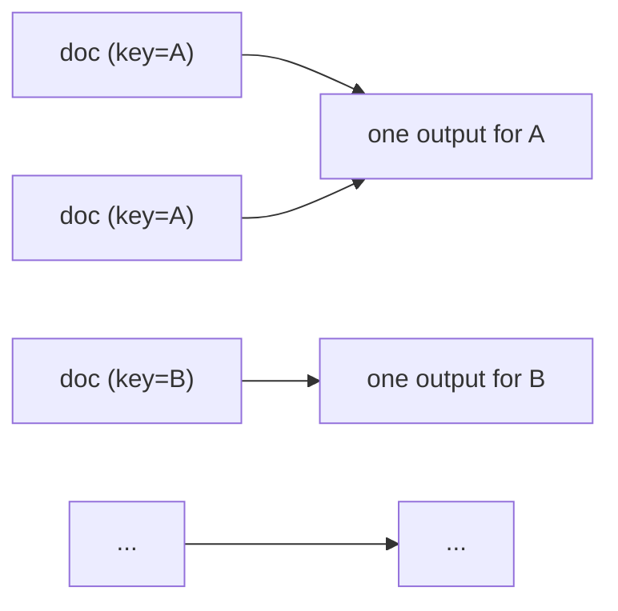

# Reduce Operation

The Reduce operation aggregates data based on a key. It supports both batch reduction and incremental folding for large datasets. Examples: consolidating patient records from multiple visits, or synthesizing findings from a set of research papers.



## Example: Summarizing Customer Feedback

=== "YAML"

    ```yaml
    - name: summarize_feedback
      type: reduce
      reduce_key: department
      prompt: |
        Summarize the customer feedback for the {{ inputs[0].department }} department:

        
        Feedback {{ loop.index }}: {{ item.feedback }}
        

        Provide a concise summary of the main points and overall sentiment.
      output:
        schema:
          summary: string
          sentiment: string
    ```

=== "Python"

    ```python
    import docetl

    docetl.default_model = "gpt-4o-mini"

    frame = docetl.read_json("feedback.json")
    frame = frame.reduce(
        reduce_key="department",
        prompt="""Summarize the customer feedback for the {{ inputs[0].department }} department:

    
    Feedback {{ loop.index }}: {{ item.feedback }}
    

    Provide a concise summary of the main points and overall sentiment.""",
        output={
            "schema": {
                "summary": "string",
                "sentiment": "string",
            }
        },
    )
    df = frame.collect()
    ```

## Configuration

### Required Parameters

- `type`: Must be set to "reduce".
- `reduce_key`: The key (or list of keys) to use for grouping data. Use `_all` to group all data into one group.
- `prompt`: The prompt template to use for the reduction operation.
- `output`: Schema definition for the output from the LLM.

### Optional Parameters

| Parameter                 | Description                                                                                            | Default                     |
| ------------------------- | ------------------------------------------------------------------------------------------------------ | --------------------------- |
| `sample`                  | Number of samples to use for the operation                                                             | None                        |
| `limit`                   | Maximum number of groups to process before stopping                                                    | All groups                  |
| `synthesize_resolve`      | If false, won't synthesize a resolve operation between map and reduce                                  | true                        |
| `model`                   | The language model to use                                                                              | Falls back to default_model |
| `input`                   | Specifies the schema or keys to subselect from each item                                               | All keys from input items   |
| `pass_through`            | If true, non-input keys from the first item in the group will be passed through                        | false                       |
| `associative`             | If true, the reduce operation is associative (i.e., order doesn't matter)                              | true                        |
| `fold_prompt`             | A prompt template for incremental folding                                                              | None                        |
| `fold_batch_size`         | Number of items to process in each fold operation                                                      | None                        |
| `value_sampling`          | A dictionary specifying the sampling strategy for large groups                                         | None                        |
| `verbose`                 | If true, enables detailed logging of the reduce operation                                              | false                       |
| `persist_intermediates`   | If true, persists the intermediate results for each group to the key `_{operation_name}_intermediates` | false                       |
| `timeout`                 | Timeout for each LLM call in seconds                                                                   | 120                         |
| `max_retries_per_timeout` | Maximum number of retries per timeout                                                                  | 2                           |
| `litellm_completion_kwargs` | Additional parameters to pass to LiteLLM completion calls. | {}                          |
| `bypass_cache` | If true, bypass the cache for this operation. | False                          |
| `retriever` | Name of a retriever to use for RAG. See [Retrievers](../retrievers.md). | None                          |
| `save_retriever_output` | If true, saves the retrieved context to `_<operation_name>_retrieved_context` in the output. | False                          |

### Limiting group processing

Set `limit` to stop after _N_ groups:

- Groups are sorted by size (smallest first) and only the _N_ smallest groups are processed; the rest are never scheduled, so you avoid extra fold/merge calls.
- If a grouped reduce returns more than one record per group, the final output list is truncated to `limit`.

## Advanced Features

### Incremental Folding

Incremental folding processes large groups in smaller batches. To enable it, provide a `fold_prompt` and `fold_batch_size`:

=== "YAML"

    ```yaml
    - name: large_data_reduce
      type: reduce
      reduce_key: category
      prompt: |
        Summarize the data for category {{ inputs[0].category }}:
        
        Item {{ loop.index }}: {{ item.data }}
        
      fold_prompt: |
        Combine the following summaries for category {{ inputs[0].category }}:
        Current summary: {{ output.summary }}
        New data:
        
        Item {{ loop.index }}: {{ item.data }}
        
      fold_batch_size: 100
      output:
        schema:
          summary: string
    ```

=== "Python"

    ```python
    frame = frame.reduce(
        name="large_data_reduce",
        reduce_key="category",
        prompt="""Summarize the data for category {{ inputs[0].category }}:
    
    Item {{ loop.index }}: {{ item.data }}
    """,
        fold_prompt="""Combine the following summaries for category {{ inputs[0].category }}:
    Current summary: {{ output.summary }}
    New data:
    
    Item {{ loop.index }}: {{ item.data }}
    """,
        fold_batch_size=100,
        output={"schema": {"summary": "string"}},
    )
    ```

#### Example Rendered Prompt

!!! example "Rendered Reduce Prompt"

    A reduce prompt that summarizes product reviews, rendered for product "PROD123":

    ```
    Summarize the reviews for product PROD123:

    Review 1: This laptop is amazing! The battery life is incredible, lasting me a full day of work without needing to charge. The display is crisp and vibrant, perfect for both work and entertainment. The only minor drawback is that it can get a bit warm during intensive tasks.

    Review 2: I'm disappointed with this purchase. While the laptop looks sleek, its performance is subpar. It lags when running multiple applications, and the fan noise is quite noticeable. On the positive side, the keyboard is comfortable to type on.

    Review 3: Decent laptop for the price. It handles basic tasks well, but struggles with more demanding software. The build quality is solid, and I appreciate the variety of ports. Battery life is average, lasting about 6 hours with regular use.

    Review 4: Absolutely love this laptop! It's lightweight yet powerful, perfect for my needs as a student. The touchpad is responsive, and the speakers produce surprisingly good sound. My only wish is that it had a slightly larger screen.

    Review 5: Mixed feelings about this product. The speed and performance are great for everyday use and light gaming. However, the webcam quality is poor, which is a letdown for video calls. The design is sleek, but the glossy finish attracts fingerprints easily.
    ```

### Scratchpad Technique

An incremental reduce may require intermediate state not represented in the output (e.g., to find all features liked by more than one person, you must track features liked once so far). DocETL maintains an internal "scratchpad" for this; users only write reduce and fold prompts.

How it works:

1. The process starts with an empty accumulator and an internal scratchpad.
2. Each fold's LLM call receives the current scratchpad state, the accumulated output, and the new batch of inputs.
3. The LLM updates both the accumulated output and the scratchpad (deciding what to write), and both are used in the next fold.

### Value Sampling

For very large groups, value sampling processes a representative subset of the data. Available methods:

| Method              | Description                                             |
| ------------------- | ------------------------------------------------------- |
| random              | Randomly select a subset of values                      |
| first_n             | Select the first N values                               |
| cluster             | Use K-means clustering to select representative samples |
| semantic_similarity | Select samples based on semantic similarity to a query  |

To enable value sampling, add a `value_sampling` configuration specifying the method, sample size, and any parameters the method requires.

!!! example "Value Sampling Configuration"

    === "YAML"

        ```yaml
        - name: sampled_reduce
          type: reduce
          reduce_key: product_id
          prompt: |
            Summarize the reviews for product {{ inputs[0].product_id }}:
            
            Review {{ loop.index }}: {{ item.review }}
            
          value_sampling:
            enabled: true
            method: cluster
            sample_size: 50
          output:
            schema:
              summary: string
        ```

    === "Python"

        ```python
        frame = frame.reduce(
            name="sampled_reduce",
            reduce_key="product_id",
            prompt="""Summarize the reviews for product {{ inputs[0].product_id }}:
        
        Review {{ loop.index }}: {{ item.review }}
        """,
            value_sampling={
                "enabled": True,
                "method": "cluster",
                "sample_size": 50,
            },
            output={"schema": {"summary": "string"}},
        )
        ```

For semantic similarity sampling, a query selects the samples most relevant to specific aspects of the data.

!!! example "Semantic Similarity Sampling"

    === "YAML"

        ```yaml
        - name: sampled_reduce_sem_sim
          type: reduce
          reduce_key: product_id
          prompt: |
            Summarize the reviews for product {{ inputs[0].product_id }}, focusing on comments about battery life and performance:
            
            Review {{ loop.index }}: {{ item.review }}
            
          value_sampling:
            enabled: true
            method: sem_sim
            sample_size: 30
            embedding_model: text-embedding-3-small
            embedding_keys:
              - review
            query_text: "Battery life and performance"
          output:
            schema:
              summary: string
        ```

    === "Python"

        ```python
        frame = frame.reduce(
            name="sampled_reduce_sem_sim",
            reduce_key="product_id",
            prompt="""Summarize the reviews for product {{ inputs[0].product_id }}, focusing on comments about battery life and performance:
        
        Review {{ loop.index }}: {{ item.review }}
        """,
            value_sampling={
                "enabled": True,
                "method": "sem_sim",
                "sample_size": 30,
                "embedding_model": "text-embedding-3-small",
                "embedding_keys": ["review"],
                "query_text": "Battery life and performance",
            },
            output={"schema": {"summary": "string"}},
        )
        ```

### Lineage

Lineage tracks the original input data for each output, useful for debugging and auditing. To enable it, add a `lineage` list to the output config specifying the keys to include:

=== "YAML"

    ```yaml
    - name: summarize_reviews_by_category
      type: reduce
      reduce_key: category
      prompt: |
        Summarize the reviews for category {{ inputs[0].category }}:
        
        Review {{ loop.index }}: {{ item.review }}
        
      output:
        schema:
          summary: string
        lineage:
          - product_id
    ```

=== "Python"

    ```python
    frame = frame.reduce(
        name="summarize_reviews_by_category",
        reduce_key="category",
        prompt="""Summarize the reviews for category {{ inputs[0].category }}:
    
    Review {{ loop.index }}: {{ item.review }}
    """,
        output={
            "schema": {"summary": "string"},
            "lineage": ["product_id"],
        },
    )
    ```

This output will include a list of all product_ids for each category in the lineage, saved under the key `summarize_reviews_by_category_lineage`.

## Best Practices

1. **Consider Data Size**: For large datasets, use incremental folding; for very large groups, use value sampling.
2. **Optimize Your Pipeline**: Use `docetl build pipeline.yaml` to optimize your pipeline, which can introduce efficient merge operations and resolve steps if needed.
