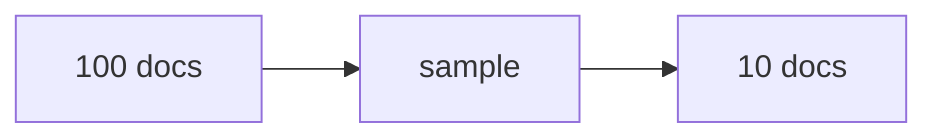

# Sample operation

The Sample operation samples items from the input. It is meant mostly as a debugging tool: insert it before the operation you're currently developing to limit the data that operation is fed, then remove it once the prompt works.



## Example:

=== "YAML"

    ```yaml
    - name: sample_concepts
      type: sample
      method: uniform
      samples: 0.1
      stratify_key: category
      random_state: 42
    ```

=== "Python"

    ```python
    import docetl

    frame = docetl.read_json("data.json")
    frame = frame.sample(
        name="sample_concepts",
        method="uniform",
        samples=0.1,
        stratify_key="category",
        random_state=42,
    )
    rows = frame.collect()
    ```

This returns a pseudo-random 10% of the input, sampled proportionally across values of the `category` key. The fixed seed (42) makes the sample reproducible across reruns; without `random_state`, a different sample is returned every time.

## Required Parameters

- name: A unique name for the operation.
- type: Must be set to "sample".
- method: The sampling method to use. Can be "uniform", "outliers", "custom", "first", "top_embedding", or "top_fts".
- samples: Either a list of key-value pairs representing document ids and values, an integer count of samples, or a float fraction of samples.

## Optional Parameters

| Parameter         | Description                                                      | Default |
| ----------------- | ---------------------------------------------------------------- | ------- |
| random_state      | An integer to seed the random generator with                    | None    |
| stratify_key      | Key(s) to stratify by. Can be a string or list of strings      | None    |
| samples_per_group | When stratifying, sample N items per group vs. proportionally  | False   |
| method_kwargs     | Additional parameters for specific methods (e.g., outliers)    | {}      |

## Sampling Methods

### Uniform Sampling

Randomly samples items from the input data. When combined with stratification, maintains the distribution of the stratified groups.

=== "YAML"

    ```yaml
    - name: uniform_sample
      type: sample
      method: uniform
      samples: 100
    ```

=== "Python"

    ```python
    frame = frame.sample(
        name="uniform_sample",
        method="uniform",
        samples=100,
    )
    ```

### First Sampling

Takes the first N items from the input. When combined with stratification, takes proportionally from each group.

=== "YAML"

    ```yaml
    - name: first_sample
      type: sample
      method: first
      samples: 50
    ```

=== "Python"

    ```python
    frame = frame.sample(
        name="first_sample",
        method="first",
        samples=50,
    )
    ```

### Outlier Sampling

Samples based on distance from a center point in embedding space. Specify the following in method_kwargs:

- embedding_keys: A list of keys to use for creating embeddings.
- std: The number of standard deviations to use as the cutoff for outliers.
- samples: The number or fraction of samples to consider as outliers.
- keep: Whether to keep (true) or remove (false) the outliers. Defaults to false.
- center: (Optional) A dictionary specifying the center point for distance calculations.

You must specify either "std" or "samples" in the method_kwargs, but not both.

=== "YAML"

    ```yaml
    - name: remove_outliers
      type: sample
      method: outliers
      method_kwargs:
        embedding_keys:
          - concept
          - description
        std: 2
        keep: false
    ```

=== "Python"

    ```python
    frame = frame.sample(
        name="remove_outliers",
        method="outliers",
        method_kwargs={
            "embedding_keys": ["concept", "description"],
            "std": 2,
            "keep": False,
        },
    )
    ```

### Custom Sampling

Samples specific items by matching key-value pairs. Stratification is not supported with custom sampling.

=== "YAML"

    ```yaml
    - name: custom_sample
      type: sample
      method: custom
      samples:
        - id: 1
        - id: 5
    ```

=== "Python"

    ```python
    frame = frame.sample(
        name="custom_sample",
        method="custom",
        samples=[{"id": 1}, {"id": 5}],
    )
    ```

### Top Embedding Sampling

Retrieves the top N most similar items to a query based on semantic similarity using embeddings. Requires the following in method_kwargs:

- keys: A list of keys to use for creating embeddings
- query: The query string to match against (supports Jinja templates)
- embedding_model: (Optional) The embedding model to use. Defaults to "text-embedding-3-small"

=== "YAML"

    ```yaml
    - name: semantic_search
      type: sample
      method: top_embedding
      samples: 10
      method_kwargs:
        keys:
          - title
          - content
        query: "machine learning applications in healthcare"
        embedding_model: text-embedding-3-small
    ```

=== "Python"

    ```python
    frame = frame.sample(
        name="semantic_search",
        method="top_embedding",
        samples=10,
        method_kwargs={
            "keys": ["title", "content"],
            "query": "machine learning applications in healthcare",
            "embedding_model": "text-embedding-3-small",
        },
    )
    ```

With Jinja template for dynamic queries:

=== "YAML"

    ```yaml
    - name: personalized_search
      type: sample
      method: top_embedding
      samples: 5
      method_kwargs:
        keys:
          - description
        query: "{{ input.user_query }}"
    ```

=== "Python"

    ```python
    frame = frame.sample(
        name="personalized_search",
        method="top_embedding",
        samples=5,
        method_kwargs={
            "keys": ["description"],
            "query": "{{ input.user_query }}",
        },
    )
    ```

### Top FTS Sampling

Retrieves the top N items using full-text search with BM25 algorithm. Requires the following in method_kwargs:

- keys: A list of keys to search within
- query: The query string for keyword matching (supports Jinja templates)

=== "YAML"

    ```yaml
    - name: keyword_search
      type: sample
      method: top_fts
      samples: 20
      method_kwargs:
        keys:
          - title
          - content
          - tags
        query: "python programming tutorial"
    ```

=== "Python"

    ```python
    frame = frame.sample(
        name="keyword_search",
        method="top_fts",
        samples=20,
        method_kwargs={
            "keys": ["title", "content", "tags"],
            "query": "python programming tutorial",
        },
    )
    ```

With dynamic query:

=== "YAML"

    ```yaml
    - name: search_products
      type: sample
      method: top_fts
      samples: 0.1  # Top 10% of results
      method_kwargs:
        keys:
          - product_name
          - description
        query: "{{ input.search_terms }}"
    ```

=== "Python"

    ```python
    frame = frame.sample(
        name="search_products",
        method="top_fts",
        samples=0.1,  # Top 10% of results
        method_kwargs={
            "keys": ["product_name", "description"],
            "query": "{{ input.search_terms }}",
        },
    )
    ```

## Stratification

Stratification can be applied to "uniform", "first", "outliers", "top_embedding", and "top_fts" methods. It ensures that the sample maintains the distribution of specified key(s) in the data or retrieves top items from each stratum.

### Single Key Stratification

=== "YAML"

    ```yaml
    - name: stratified_sample
      type: sample
      method: uniform
      samples: 0.2
      stratify_key: category
    ```

=== "Python"

    ```python
    frame = frame.sample(
        name="stratified_sample",
        method="uniform",
        samples=0.2,
        stratify_key="category",
    )
    ```

### Multiple Key Stratification

When using multiple keys, stratification is based on the combination of values:

=== "YAML"

    ```yaml
    - name: multi_stratified_sample
      type: sample
      method: uniform
      samples: 50
      stratify_key: 
        - type
        - size
    ```

=== "Python"

    ```python
    frame = frame.sample(
        name="multi_stratified_sample",
        method="uniform",
        samples=50,
        stratify_key=["type", "size"],
    )
    ```

### Samples Per Group

Instead of proportional sampling, you can sample a fixed number from each stratum:

=== "YAML"

    ```yaml
    - name: stratified_per_group
      type: sample
      method: uniform
      samples: 10  # Sample 10 items from each group
      stratify_key: category
      samples_per_group: true
    ```

=== "Python"

    ```python
    frame = frame.sample(
        name="stratified_per_group",
        method="uniform",
        samples=10,  # Sample 10 items from each group
        stratify_key="category",
        samples_per_group=True,
    )
    ```

This also works with fractions:

=== "YAML"

    ```yaml
    - name: stratified_fraction_per_group
      type: sample
      method: uniform
      samples: 0.3  # Sample 30% from each group
      stratify_key: category
      samples_per_group: true
    ```

=== "Python"

    ```python
    frame = frame.sample(
        name="stratified_fraction_per_group",
        method="uniform",
        samples=0.3,  # Sample 30% from each group
        stratify_key="category",
        samples_per_group=True,
    )
    ```

## Complete Examples

Stratified outlier detection:

=== "YAML"

    ```yaml
    - name: stratified_outliers
      type: sample
      method: outliers
      stratify_key: document_type
      method_kwargs:
        embedding_keys:
          - title
          - content
        std: 1.5
        keep: false
    ```

=== "Python"

    ```python
    frame = frame.sample(
        name="stratified_outliers",
        method="outliers",
        stratify_key="document_type",
        method_kwargs={
            "embedding_keys": ["title", "content"],
            "std": 1.5,
            "keep": False,
        },
    )
    ```

Stratified first sampling with multiple keys:

=== "YAML"

    ```yaml
    - name: stratified_first
      type: sample
      method: first
      samples: 100
      stratify_key:
        - category
        - priority
      samples_per_group: false  # Take proportionally from each combination
    ```

=== "Python"

    ```python
    frame = frame.sample(
        name="stratified_first",
        method="first",
        samples=100,
        stratify_key=["category", "priority"],
        samples_per_group=False,  # Take proportionally from each combination
    )
    ```

Outlier sampling with a custom center:

=== "YAML"

    ```yaml
    - name: centered_outliers
      type: sample
      method: outliers
      method_kwargs:
        embedding_keys:
          - concept
          - description
        center:
          concept: Tree house
          description: A small house built among the branches of a tree for children to play in.
        samples: 20  # Keep the 20 furthest items from the center
        keep: true
    ```

=== "Python"

    ```python
    frame = frame.sample(
        name="centered_outliers",
        method="outliers",
        method_kwargs={
            "embedding_keys": ["concept", "description"],
            "center": {
                "concept": "Tree house",
                "description": "A small house built among the branches of a tree for children to play in.",
            },
            "samples": 20,  # Keep the 20 furthest items from the center
            "keep": True,
        },
    )
    ```

Stratified semantic search - retrieve top documents from each category:

=== "YAML"

    ```yaml
    - name: stratified_semantic_search
      type: sample
      method: top_embedding
      samples: 5  # Get top 5 from each category
      stratify_key: category
      samples_per_group: true
      method_kwargs:
        keys:
          - title
          - abstract
        query: "recent advances in artificial intelligence"
    ```

=== "Python"

    ```python
    frame = frame.sample(
        name="stratified_semantic_search",
        method="top_embedding",
        samples=5,  # Get top 5 from each category
        stratify_key="category",
        samples_per_group=True,
        method_kwargs={
            "keys": ["title", "abstract"],
            "query": "recent advances in artificial intelligence",
        },
    )
    ```

Full-text search with multiple stratification keys:

=== "YAML"

    ```yaml
    - name: stratified_keyword_search
      type: sample
      method: top_fts
      samples: 3
      stratify_key:
        - department
        - priority
      samples_per_group: true
      method_kwargs:
        keys:
          - subject
          - content
        query: "urgent customer complaint refund"
    ```

=== "Python"

    ```python
    frame = frame.sample(
        name="stratified_keyword_search",
        method="top_fts",
        samples=3,
        stratify_key=["department", "priority"],
        samples_per_group=True,
        method_kwargs={
            "keys": ["subject", "content"],
            "query": "urgent customer complaint refund",
        },
    )
    ```

## Note on TopK Operation

For retrieval use cases, the [TopK operation](topk.md) covers the same functionality as `top_embedding` and `top_fts`, plus LLM-based ranking (`llm_compare`).
