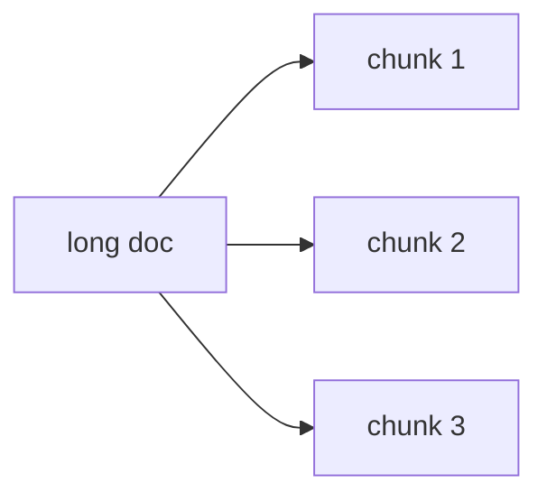

# Split Operation

The Split operation divides long text content into smaller chunks. Use it when documents exceed token limits or when LLM accuracy degrades on long inputs.



## Operation Example: Splitting Customer Support Transcripts

=== "YAML"

    ```yaml
    - name: split_transcript
      type: split
      split_key: transcript
      method: token_count
      method_kwargs:
        num_tokens: 500
        model: gpt-4o-mini
    ```

=== "Python"

    ```python
    import docetl

    docetl.default_model = "gpt-4o-mini"

    frame = docetl.read_json("transcripts.json")
    frame = frame.split(
        split_key="transcript",
        method="token_count",
        method_kwargs={"num_tokens": 500, "model": "gpt-4o-mini"},
    )
    df = frame.collect()
    ```

This splits the 'transcript' field into chunks of approximately 500 tokens (counted with the gpt-4o-mini tokenizer), producing one output item per chunk. Chunks do not overlap in content.

## Configuration

### Required Parameters

- `type`: Must be set to "split".
- `split_key`: The key of the field containing the text to split.
- `method`: The method to use for splitting. Options are "delimiter" and "token_count".
- `method_kwargs`: A dictionary of keyword arguments for the splitting method.
  - For "delimiter" method: `delimiter` (string) to use for splitting.
  - For "token_count" method: `num_tokens` (integer) specifying the maximum number of tokens per chunk.

### Optional Parameters in `method_kwargs

| Parameter             | Description                                                                     | Default                       |
| --------------------- | ------------------------------------------------------------------------------- | ----------------------------- |
| `model`               | The language model's tokenizer to use                                           | Falls back to `default_model` |
| `num_splits_to_group` | Number of splits to group together into one chunk (only for "delimiter" method) | 1                             |
| `sample`              | Number of samples to use for the operation                                                      | None                        |

### Splitting Methods

#### Token Count Method

Splits the text into chunks of a specified number of tokens. Use it to keep each chunk within a model's token limit, or when smaller chunks give better accuracy.

#### Delimiter Method

Splits the text on a specified delimiter string. Use it to split at logical boundaries such as paragraphs or sections.

!!! note "Delimiter Method Example"

    If you set the `delimiter` to `"\n\n"` (double newline) and `num_splits_to_group` to 3, each chunk will contain 3 paragraphs.

    === "YAML"

        ```yaml
        - name: split_by_paragraphs
          type: split
          split_key: document
          method: delimiter
          method_kwargs:
            delimiter: "\n\n"
          num_splits_to_group: 3
        ```

    === "Python"

        ```python
        frame = frame.split(
            name="split_by_paragraphs",
            split_key="document",
            method="delimiter",
            method_kwargs={"delimiter": "\n\n"},
            num_splits_to_group=3,
        )
        ```

## Output

The Split operation generates multiple output items for each input item:

- All original key-value pairs from the input item.
- `{split_key}_chunk`: The content of the split chunk.
- `{op_name}_id`: A unique identifier for each original document.
- `{op_name}_chunk_num`: The sequential number of the chunk within its original document.

## Use Cases

Split is typically followed by a map over each chunk and a reduce per original document:

1. **Analyzing Customer Frustration**: split transcripts, map to identify frustration indicators per chunk, reduce to summarize per transcript.
2. **Document Summarization**: split, map for section-wise summaries, reduce to compile an overall summary.
3. **Topic Extraction**: split papers into sections, map to extract topics, reduce to synthesize main themes.

## End-to-End Pipeline Example: Analyzing Customer Frustration

### Step 1: Split Operation

=== "YAML"

    ```yaml
    - name: split_transcript
      type: split
      split_key: transcript
      method: token_count
      method_kwargs:
        num_tokens: 500
        model: gpt-4o-mini
    ```

=== "Python"

    ```python
    import docetl

    docetl.default_model = "gpt-4o-mini"

    pipeline = docetl.read_json("transcripts.json")
    pipeline = pipeline.split(
        name="split_transcript",
        split_key="transcript",
        method="token_count",
        method_kwargs={"num_tokens": 500, "model": "gpt-4o-mini"},
    )
    ```

### Step 2: Map Operation (Identify Frustration Indicators)

=== "YAML"

    ```yaml
    - name: identify_frustration
      type: map
      input:
        - transcript_chunk
      prompt: |
        Analyze the following customer support transcript chunk for signs of customer frustration:

        {{ input.transcript_chunk }}

        Identify any indicators of frustration, such as:
        1. Use of negative language
        2. Repetition of issues
        3. Expressions of dissatisfaction
        4. Requests for escalation

        Provide a list of frustration indicators found, if any.
      output:
        schema:
          frustration_indicators: list[string]
    ```

=== "Python"

    ```python
    pipeline = pipeline.map(
        name="identify_frustration",
        input=["transcript_chunk"],
        prompt="""Analyze the following customer support transcript chunk for signs of customer frustration:

    {{ input.transcript_chunk }}

    Identify any indicators of frustration, such as:
    1. Use of negative language
    2. Repetition of issues
    3. Expressions of dissatisfaction
    4. Requests for escalation

    Provide a list of frustration indicators found, if any.""",
        output={"schema": {"frustration_indicators": "list[string]"}},
    )
    ```

### Step 3: Reduce Operation (Summarize Frustration Points)

=== "YAML"

    ```yaml
    - name: summarize_frustration
      type: reduce
      reduce_key: split_transcript_id
      associative: false
      prompt: |
        Summarize the customer frustration points for this support transcript:

        
        Chunk {{ item.split_transcript_chunk_num }}:
        
        - {{ indicator }}
        
        

        Provide a concise summary of the main frustration points and their frequency or intensity across the entire transcript.
      output:
        schema:
          frustration_summary: string
          primary_issues: list[string]
          frustration_level: string # e.g., "low", "medium", "high"
    ```

=== "Python"

    ```python
    pipeline = pipeline.reduce(
        name="summarize_frustration",
        reduce_key="split_transcript_id",
        associative=False,
        prompt="""Summarize the customer frustration points for this support transcript:

    
    Chunk {{ item.split_transcript_chunk_num }}:
    
    - {{ indicator }}
    
    

    Provide a concise summary of the main frustration points and their frequency or intensity across the entire transcript.""",
        output={
            "schema": {
                "frustration_summary": "string",
                "primary_issues": "list[string]",
                "frustration_level": "string",  # e.g., "low", "medium", "high"
            }
        },
    )
    df = pipeline.collect()
    ```

!!! important "Non-Associative Reduce Operation"

    Note the `associative: false` parameter in the reduce operation. When chunk order matters, it ensures the reduce processes chunks in the order they appear in the original transcript.

## Best Practices

1. **Balance Chunk Size**: Smaller chunks may lose context, while larger chunks may degrade model accuracy. The DocETL optimizer can find the chunk size that works best for your task.

2. **Consider Overlap**: Overlap between chunks isn't built into the Split operation, but you can achieve it by post-processing the split chunks.

3. **Use Appropriate Delimiters**: Choose a delimiter that logically divides your text (e.g., double newlines for paragraphs, custom markers for sections), and adjust `num_splits_to_group` so chunks contain enough context for your task.

4. **Mind the Order**: If chunk order matters for your analysis, set `associative: false` in subsequent reduce operations.

5. **Combine Methods**: For very large documents, first split into large sections using delimiters, then apply token count splitting so no chunk exceeds model limits.
