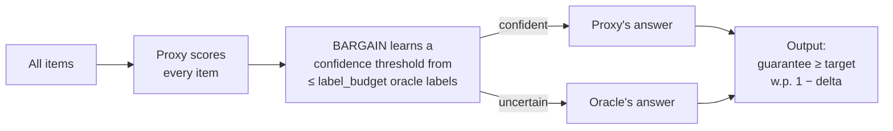

# Model Cascades with BARGAIN

Three DocETL operators issue an LLM call whose output is a single **binary**
value: `filter` (keep/drop), and `resolve` / `equijoin` (match/no-match on
candidate pairs). For these, a cheap "proxy" model is usually right, and only
the hard cases need the expensive "oracle" (the operator's existing `model` or
`comparison_model`).

A **model cascade** runs the proxy on everything, learns a confidence
threshold from a small oracle-labeled sample, trusts the proxy above the
threshold, and escalates the rest — while preserving a **statistical
guarantee** that holds with probability `1 - delta`.



The statistical core is **BARGAIN**: Sepanta Zeighami, Shreya Shankar, Aditya
Parameswaran. ["Cut Costs, Not Accuracy: LLM-Powered Data Processing with
Guarantees."](https://arxiv.org/abs/2509.02896) *ACM SIGMOD 2026.*
([code](https://github.com/ucbepic/BARGAIN)) DocETL depends on the BARGAIN
library for threshold learning and guarantee certification, and wraps it with
thin adapters for each operator.

## Enabling a cascade

Add an opt-in `cascade:` block to a supported operator:

=== "YAML"

    ```yaml
    - name: is_relevant
      type: filter
      model: gpt-4o                  # oracle (unchanged)
      prompt: "Is this document about climate policy? {{ input.text }}"
      output: { schema: { keep: "bool" } }
      cascade:
        proxy_model: gpt-4o-mini     # the cheap model
        guarantee: recall            # default for filter
        target: 0.95                 # keep >= 95% of truly-relevant docs
        delta: 0.05                  # guarantee holds w.p. 1 - delta
        label_budget: 300            # max oracle calls to learn the threshold
    ```

=== "Python"

    ```python
    pipeline = pipeline.filter(
        name="is_relevant",
        model="gpt-4o",
        prompt="Is this document about climate policy? {{ input.text }}",
        output={"schema": {"keep": "bool"}},
        cascade={
            "proxy_model": "gpt-4o-mini",
            "guarantee": "recall",
            "target": 0.95,
            "delta": 0.05,
            "label_budget": 300,
        },
    )
    ```

Everything else about the pipeline is unchanged — run it with `docetl run
pipeline.yaml` or `.collect()` as usual.

## Parameters

| Parameter | Type | Description | Default |
|---|---|---|---|
| `proxy_model` | string | The cheap model for the proxy pass (required). A chat model or an embedding model — see below | — |
| `guarantee` | string | `accuracy`, `precision`, or `recall` (see [Guarantees](#guarantees)) | operator-specific |
| `target` | float | Target value for the guarantee metric, strictly inside `(0, 1)` (required) | — |
| `delta` | float | Failure probability; the guarantee holds with probability `1 - delta` | `0.05` |
| `label_budget` | int | Maximum oracle calls spent learning the confidence threshold (`precision` / `recall` only; `precision+recall` adapts its oracle usage and ignores this) | `400` |

`target` must be strictly between 0 and 1; `target: 1.0` is rejected at
validation. A target of exactly 100% cannot be certified from a finite oracle
sample — use `0.99` instead.

### Embedding models as the proxy

`proxy_model` can be an embedding model (e.g. `text-embedding-3-small`),
detected from litellm's model registry. The cascade then:

- embeds every item (in batches),
- oracle-labels a training sample (half of `label_budget`, at most 200) and
  fits a logistic regression on those embeddings,
- uses the regression's probabilities as the proxy scores,
- runs the threshold search with the remaining budget, on rows disjoint from
  the training sample.

Training rows keep their oracle answers in the output. If all training labels
come back the same class, the regression cannot be fit and every item goes to
the oracle.

=== "YAML"

    ```yaml
    - name: is_relevant
      type: filter
      model: gpt-4o
      prompt: "Is this review about shipping problems? {{ input.text }}"
      output: { schema: { keep: "bool" } }
      cascade:
        proxy_model: text-embedding-3-small
        target: 0.95
        label_budget: 200   # half is used to fit the regression
    ```

=== "Python"

    ```python
    pipeline = pipeline.filter(
        name="is_relevant",
        model="gpt-4o",
        prompt="Is this review about shipping problems? {{ input.text }}",
        output={"schema": {"keep": "bool"}},
        cascade={
            "proxy_model": "text-embedding-3-small",
            "target": 0.95,
            "label_budget": 200,  # half is used to fit the regression
        },
    )
    ```

## Guarantees

| Guarantee | What it means | Best for | BARGAIN procedure |
|---|---|---|---|
| `accuracy` | Output matches the oracle on ≥ `target` fraction of items | Any binary operator | BARGAIN_A |
| `precision` | Of items returned positive, ≥ `target` are truly positive | `resolve` / `equijoin` (don't over-merge) | BARGAIN_P |
| `recall` | Of truly-positive items, ≥ `target` are returned | `filter` (don't drop relevant docs) | BARGAIN_R |
| `precision+recall` | Both precision and recall ≥ `target`, jointly | When neither error direction is acceptable | BARGAIN_PR |

### Guaranteeing both at once

`guarantee: precision+recall` enforces both metrics at `target`
simultaneously. It learns two thresholds — items above the precision
threshold take the proxy's positive answer, items below the recall threshold
take the proxy's negative answer, and the oracle labels the band in between.
Oracle usage adapts to how well the proxy separates the data (`label_budget`
is ignored).

=== "YAML"

    ```yaml
    - name: is_relevant
      type: filter
      model: gpt-4o
      prompt: "Is this document about climate policy? {{ input.text }}"
      output: { schema: { keep: "bool" } }
      cascade:
        proxy_model: gpt-4o-mini
        guarantee: precision+recall
        target: 0.9     # precision >= 0.9 AND recall >= 0.9, w.p. 1 - delta
    ```

=== "Python"

    ```python
    pipeline = pipeline.filter(
        name="is_relevant",
        model="gpt-4o",
        prompt="Is this document about climate policy? {{ input.text }}",
        output={"schema": {"keep": "bool"}},
        cascade={
            "proxy_model": "gpt-4o-mini",
            "guarantee": "precision+recall",
            "target": 0.9,  # precision >= 0.9 AND recall >= 0.9, w.p. 1 - delta
        },
    )
    ```

When `guarantee` is omitted, the operator's natural default applies:
`filter` → `recall`, `resolve` / `equijoin` → `precision`. Quality is always
measured against the oracle's answers, treated as ground truth.

If the oracle sample is too small to certify the `target` at the chosen
`delta`, the engine errs toward the guarantee — escalating or keeping more
items — rather than silently violating it. Give `label_budget` enough room
for a meaningful sample on small datasets.

### resolve / equijoin

For pair operators, the cascade runs over the candidate pairs produced by
**existing blocking**: proxy on all pairs, oracle on a calibrated subset.
Matched pairs feed the existing clustering (resolve) / join (equijoin)
unchanged.

=== "YAML"

    ```yaml
    - name: dedupe
      type: resolve
      comparison_model: gpt-4o
      comparison_prompt: "Are these the same entity? {{ input1.name }} / {{ input2.name }}"
      blocking_threshold: 0.8
      cascade: { proxy_model: gpt-4o-mini, target: 0.9 }    # guarantee=precision
    ```

=== "Python"

    ```python
    pipeline = pipeline.resolve(
        name="dedupe",
        comparison_model="gpt-4o",
        comparison_prompt="Are these the same entity? {{ input1.name }} / {{ input2.name }}",
        blocking_threshold=0.8,
        cascade={"proxy_model": "gpt-4o-mini", "target": 0.9},  # guarantee=precision
    )
    ```

## Reading the output

While the operator runs, the cascade logs what it did:

```text
Cascade filter 'is_relevant'
           proxy     gpt-4o-mini · 1000 scored · $0.0200
           oracle    gpt-4o · 137 sampled for calibration (budget 300) · $0.4000
           guarantee recall ≥ 95%  δ=0.05
           threshold 0.847 proxy confidence
           result    863 proxy-accepted + 137 calibration samples → 1000 items
           total cost $0.4200
```

All 1000 items were proxy-scored; 137 oracle calls learned the threshold, and
the remaining 863 were decided by the proxy alone — versus 1000 oracle calls
without the cascade. The same numbers are available programmatically as
`op.cascade_stats` (`n_items`, `proxy_calls`, `oracle_calls`,
`escalation_rate`, `guarantee`, `target`, `delta`).

Results are cached, keyed on the operation's config and a signature of the
input items: an identical re-run replays the recorded result without new
model calls. Set `bypass_cache: true` to force recomputation.

## Limitations

- **Binary predictions only** — `filter`, `resolve`, `equijoin`. Multiclass
  (`map` with enum) is not supported.
- Chat-model proxies score via **single-token logprobs**, so the provider
  must return logprobs (a clear error is raised otherwise). Embedding-model
  proxies don't have this requirement.
- Retrieval context and PDF inputs are not wired into the cascade path;
  combining `cascade` with a `retriever` or `pdf_url_key` is **rejected at
  config validation** rather than silently dropping context.
