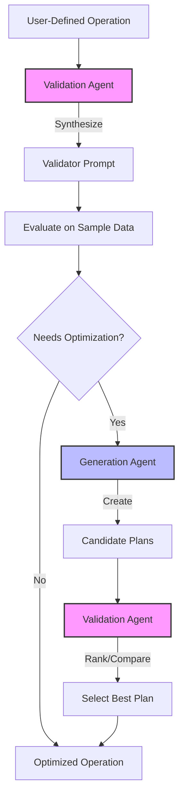

# DocETL Optimizer

DocETL provides two optimizer options to improve your document processing pipelines:

## MOAR Optimizer (Recommended)

The **MOAR (Multi-Objective Agentic Rewrites)** optimizer uses Monte Carlo Tree Search to explore optimization space and find Pareto-optimal solutions that balance accuracy and cost. It's the recommended optimizer for most use cases.

**Key Features:**

- Multi-objective optimization (accuracy + cost)
- Returns multiple Pareto-optimal solutions
- Automatic model exploration
- Custom evaluation functions
- Intelligent search using MCTS

See the [MOAR Optimizer Guide](moar.md) for detailed documentation and examples.

## V1 Optimizer (Deprecated)

!!! warning "Deprecated"
    The V1 optimizer is deprecated and no longer recommended. Use MOAR instead for all new optimizations.

The V1 optimizer uses a greedy approach with validation to find improved pipeline configurations. It's still available for backward compatibility but should not be used for new projects.

The rest of this page describes the general optimization concepts that apply to both optimizers.

## Key Features

- Automatically decomposes complex operations into more efficient sub-pipelines
- Inserts resolve operations before reduce operations when beneficial
- Optimizes for large documents that exceed context limits
- Improves accuracy in high-volume reduce operations with incremental reduce

## How It Works

The optimizer employs AI agents to generate and validate potential optimizations:

1. **Generation Agents**: Create alternative plans for operations, potentially breaking them down into multiple steps.
2. **Validation Agents**: Evaluate and compare the outputs of different plans to determine the most effective approach.

  

  

## Should I Use the Optimizer?

While any pipeline can potentially benefit from optimization, there are specific scenarios where using the optimizer can significantly improve your pipeline's performance and accuracy. When should you use the optimizer?

!!! info "Large Documents"

    If you have documents that approach or exceed context limits and a map operation that transforms these documents using an LLM, the optimizer can help:

    - Improve accuracy
    - Enable processing of entire documents
    - Optimize for large-scale data handling

!!! info "Entity Resolution"
The optimizer is particularly useful when:

    - You need a resolve operation before your reduce operation
    - You've defined a resolve operation but want to optimize it for speed using blocking

!!! info "High-Volume Reduce Operations"
Consider using the optimizer when:

    - You have many documents feeding into a reduce operation for a given key
    - You're concerned about the accuracy of the reduce operation due to high volume
    - You want to optimize for better accuracy in complex reductions

Even if your pipeline doesn't fall into these specific categories, optimization can still be beneficial. For example, the optimizer can enhance your operations by adding gleaning to an operation, which uses an LLM-powered validator to ensure operation correctness. [Learn more about gleaning](../concepts/operators.md).

## Example: Optimizing Legal Contract Analysis

Let's consider a pipeline for analyzing legal contracts, extracting clauses, and summarizing them by type. Initially, you might have a single map operation to extract and tag clauses, followed by a reduce operation to summarize them. However, this approach might not be accurate enough for long contracts.

### Initial Pipeline

In the initial pipeline, you might have a single map operation that attempts to extract all clauses and tag them with their types in one go. This is followed by a reduce operation that summarizes the clauses by type. Maybe the reduce operation accurately summarizes the clauses in a single LLM call per clause type, but the map operation might not be able to accurately extract and tag the clauses in a single LLM call.

### Optimized Pipeline

After applying the optimizer, your pipeline could be transformed into a more efficient and accurate sub-pipeline:

1. **Split Operation**: Breaks down _each_ long contract into manageable chunks.
2. **Map Operation**: Processes each chunk to extract and tag clauses.
3. **Reduce Operation**: For each contract, combine the extracted and tagged clauses from each chunk.

The goal of the DocETL optimizer is to try many ways of rewriting your pipeline and then select the best one. This may take some time (20-30 minutes for very complex tasks and large documents). But the optimizer's ability to break down complex tasks into more manageable sub-steps can lead to more accurate and reliable results.

## Choosing an Optimizer

**Use MOAR if:**

- You want to explore cost-accuracy trade-offs
- You need multiple solution options (Pareto frontier)
- You have custom evaluation metrics
- You want automatic model exploration

!!! warning "V1 Optimizer Deprecated"
    The V1 optimizer is deprecated. Use MOAR instead. If you have existing V1-optimized pipelines, they will continue to work, but new optimizations should use MOAR.

For detailed MOAR usage, see the [MOAR Optimizer Guide](moar.md).
