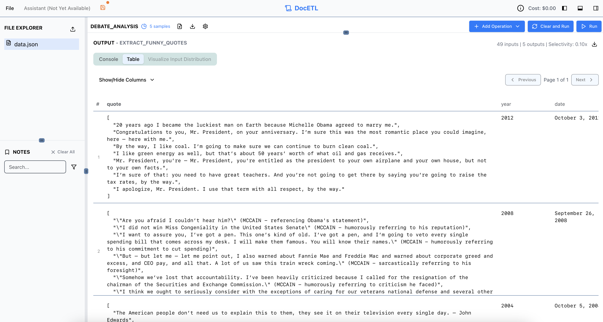
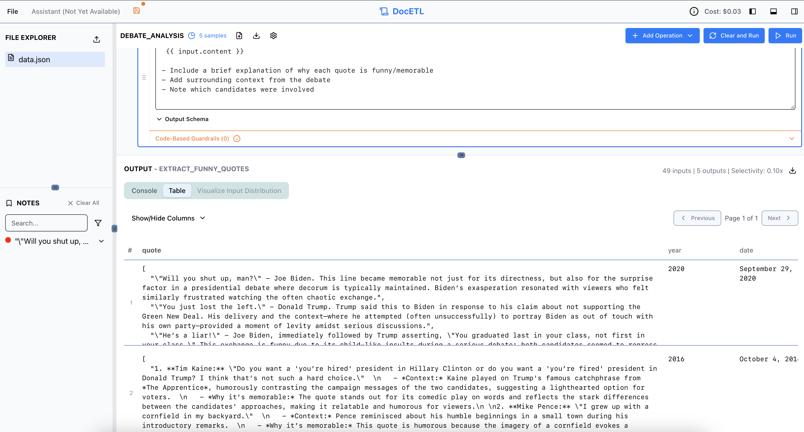
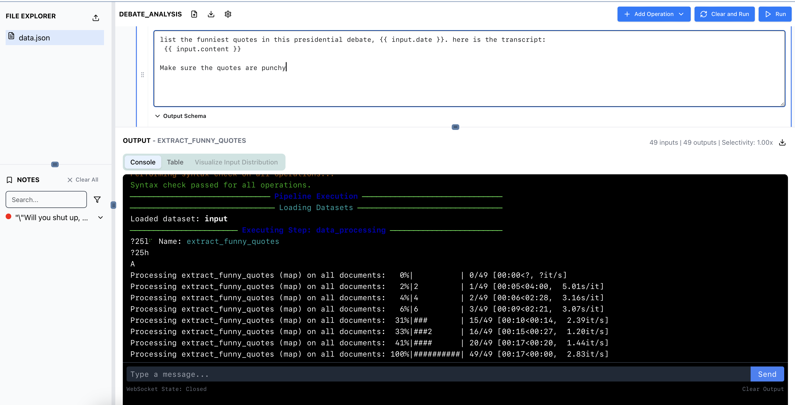
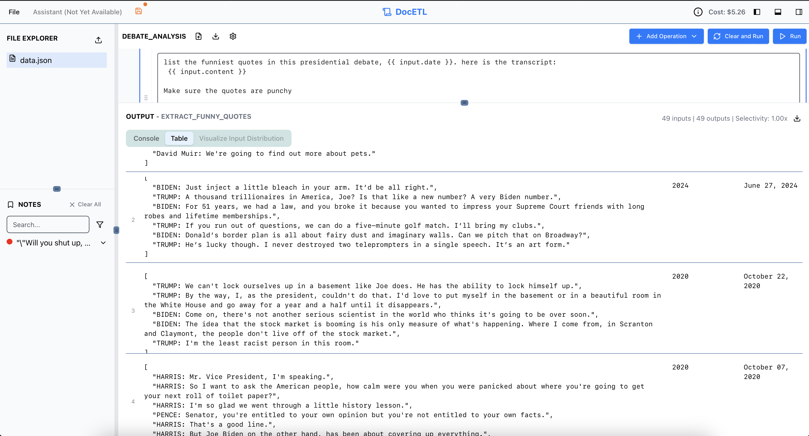

# Simple Tutorial: Extracting Funny Quotes from Presidential Debates

In this tutorial, we'll walk through using the DocETL playground to extract funny or memorable quotes from presidential debate transcripts. We'll see how to:

1. Upload and explore data
2. Run a basic pipeline with sampling
3. Examine outputs
4. Iterate on prompts to improve results

## Step 1: Upload the Data

First, download the presidential debates dataset from [here](https://raw.githubusercontent.com/ucbepic/docetl/refs/heads/main/example_data/debates/data.json).

Once downloaded, use the left sidebar's upload button to load the data into the playground. The data contains transcripts from various presidential debates.

You can view the data by clicking the "toggle dataset view" button in the top right corner of the screen:

## Step 2: Examine the Example Operation

You'll notice there's already an example operation called `extract_funny_quotes`. This is a Map operation that processes each debate transcript to extract funny or memorable quotes.

The pipeline is set to run on a sample of 5 documents, as indicated by the sample icon next to the pipeline name. This sampling helps us quickly test and iterate on our prompts without processing the entire dataset.

To adjust the sample size or change other pipeline settings like the default language model:

1. Click the gear (⚙️) button next to the pipeline name
2. Modify the sample size or other settings as needed
3. Save your changes

If you expand the operation details, you'll see the output schema is configured to produce a list of quote strings.

## Step 3: Run the Pipeline and Check Outputs

Click the "Run" button to execute the pipeline. The outputs panel will show two important tabs:

- **Console**: Displays progress information and any potential errors
- **Table**: Shows the extracted funny quotes from each document in a table, as well as the other key/value pairs in the document. Here's what the table looks like after running the pipeline:

You can resize the rows and columns in the table by clicking and dragging the edges of the table cells, as in the image above. You can also rezise the outputs panel by clicking and dragging the top edge of the panel.

## Step 4: Iterate on the Prompt

After reviewing the initial outputs, we might want to improve the results. For example, maybe we want more context around each quote to better understand why it's funny or memorable.

We can modify the prompt to request additional context. Click on the operation to edit its prompt, adding instructions like:

- Include a brief explanation of why each quote is funny/memorable
- Add surrounding context from the debate
- Note which candidates were involved

Each time you modify the prompt, you can quickly test it on the sample documents to see if the results improve. Here's an example of what the outputs might look like after modifying the prompt:

Remember to save your progress using the save button in the top left corner! This will save the current state of the pipeline, including any changes you've made to the prompt or other settings, such that if you refresh the page, you'll still see the same pipeline and results.

!!! note "Caching Behavior"
    DocETL automatically caches the outputs of each operation. This means that if you run the pipeline multiple times without changing the operations, it will use the cached results instead of reprocessing the documents. This is especially helpful when:

    - Iterating on downstream operations in a multi-step pipeline
    - Running the pipeline on the full dataset after testing on samples
    - Sharing results with teammates (cached outputs persist across sessions)

    The cache is invalidated only when you modify an operation's configuration (e.g., changing the prompt or schema). This ensures you always see fresh results when making changes while avoiding unnecessary recomputation.

    If you want to bypass the cache and force recomputation, you can click the "Clear and Run" button instead of the regular "Run" button.

!!! tip "Taking Notes"
    You can highlight any text in the outputs panel to save it as a note. This is useful for:
    
    - Marking interesting quotes or patterns you want to revisit
    - Collecting examples of where the prompt works well (or needs improvement)
    
    Selected text will be saved to the Notes panel, which you can access by clicking the "Notes" tab in the outputs section. Notes persist to local storage, so they will be available the next time you visit the playground. 
    
    We are also working on the Assistant, which will use notes to steer your operation prompts towards better results.

## Step 5: Run the Pipeline on the Entire Dataset

Once you're satisfied with your prompt, you can run the pipeline on the entire dataset. First, clear the sample size by clicking on the settings or gear icon next to the pipeline name. 

Then, click the "Run" button again. This will process all documents and update the outputs panel with the results. Here's what the outputs might look like after running the pipeline on the full dataset (the console view and table view are shown below):

You can export the results to a CSV file by clicking the "download" button in the top right corner of the outputs panel, near where it says "Selectivity: 1.00x". The selectivity is the ratio of the number of documents in the output to the number of documents in the input for that operation. In this case, since we ran the pipeline on the full dataset, the selectivity is 1.0x.

!!! warning "Model Note"

    In this tutorial, we used `azure/gpt-4o` instead of `gpt-4o-mini` since content filters were triggered by `gpt-4o-mini` when processing political debate content. If you encounter similar content filter issues with `gpt-4o-mini`, consider using `azure/gpt-4o` or another model with less restrictive filters.

