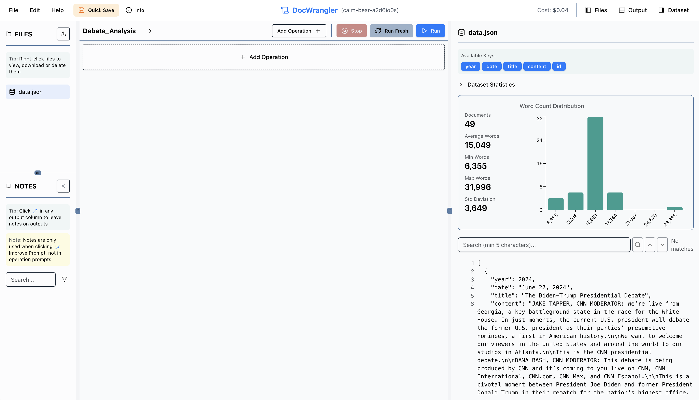
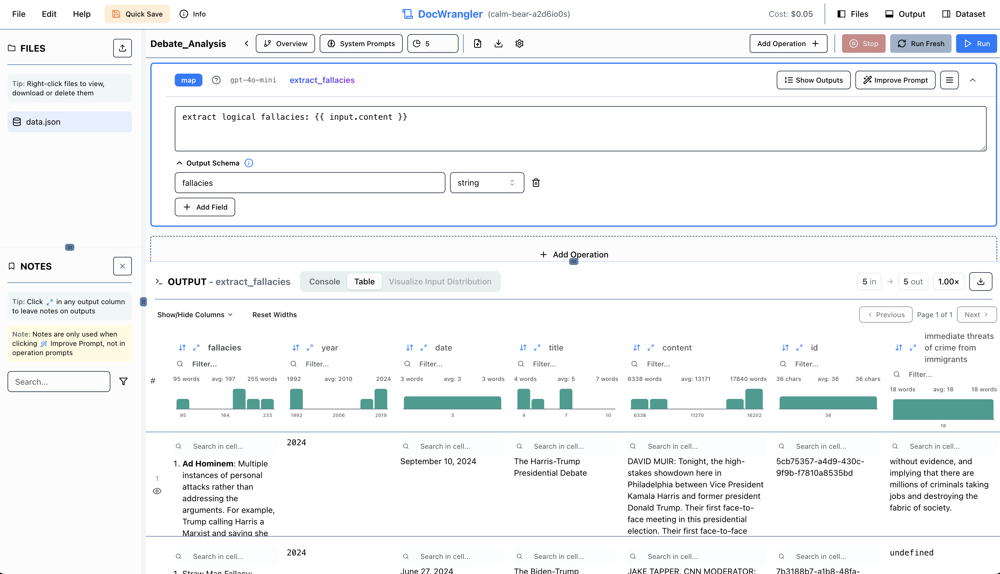
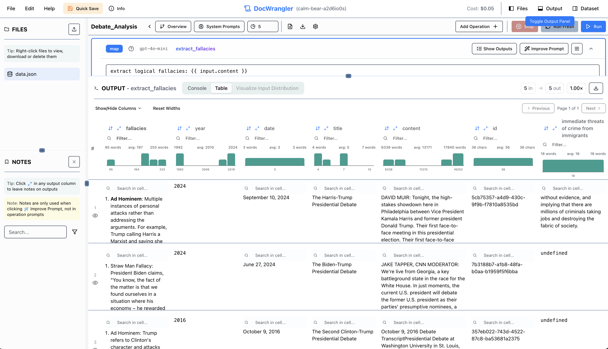
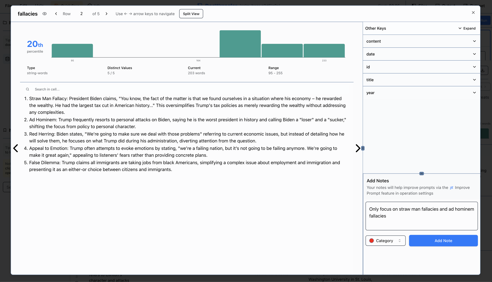
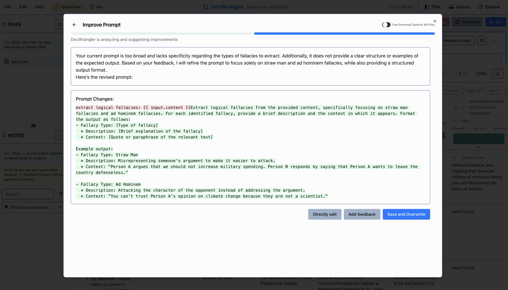
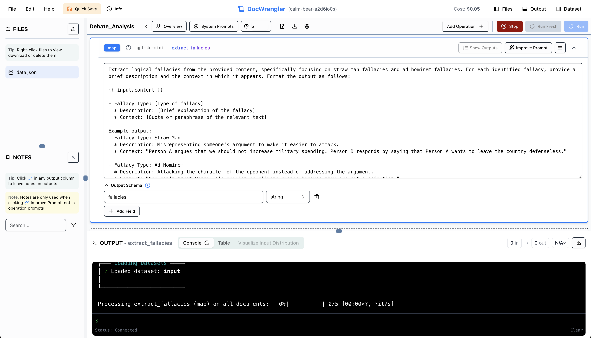

# Simple Tutorial: Extracting Funny Quotes from Presidential Debates

In this tutorial, we'll walk through using the DocETL playground to extract funny or memorable quotes from presidential debate transcripts. We'll see how to:

1. Upload and explore data
2. Run a basic pipeline with sampling
3. Examine outputs
4. Iterate on prompts to improve results

## Step 1: Upload the Data

First, download the presidential debates dataset from [here](https://raw.githubusercontent.com/ucbepic/docetl/refs/heads/main/example_data/debates/data.json).

Once downloaded, use the left sidebar's upload button to load the data into the playground. The data contains transcripts from various presidential debates.

You can view the data by clicking the "toggle dataset view" button in the top right corner of the screen:

## Step 2: Add a Map Operation

The pipeline is set to run on a sample of 5 documents, as indicated by the sample icon next to the pipeline name. This sampling helps us quickly test and iterate on our prompts without processing the entire dataset. This can be changed.

We'll add a map operation that processes each debate transcript to extract logical fallacies. Click the "Add Operation" button in the top right corner of the screen, and select "Map" under the LLM section. You can set the operation name to "extract_fallacies", and write a prompt and output schema. 

## Step 3: Run the Pipeline and Check Outputs

Click the "Run" button to execute the pipeline. The outputs panel will show two important tabs:

- **Console**: Displays progress information and any potential errors
- **Table**: Shows the extracted funny quotes from each document in a table, as well as the other key/value pairs in the document. Here's what the table looks like after running the pipeline:

You can resize the rows and columns in the table by clicking and dragging the edges of the table cells, as in the image above. You can also rezise the outputs panel by clicking and dragging the top edge of the panel.

## Step 4: Iterate on the Prompt

After reviewing the initial outputs, let's inspect them row by row to identify areas for improvement. Click the expand icon next to any column to see the full content.

We can modify the prompt to request additional context based on what we observe in the data. Here are some general patterns that could use improvement:

- Some quotes lack sufficient background context
- Speaker information could be more detailed
- The reasoning behind why quotes are memorable isn't always clear
- Time and setting details are often missing
- Impact and reactions to quotes aren't consistently captured

Here's an example of what giving notes might look like:

Once you've added enough notes (3-5 or more), you can click on the "Improve Prompt" button in the top right corner of the operation card. This will invoke the DocWrangler Prompt Improvement Assistant, which will suggest edits to your prompt:

Once you're satisfied with the new prompt, click "Save" to update the operation, and then you can rerun the pipeline to see the new outputs.

!!! note "Caching Behavior"

    DocETL automatically caches the outputs of each operation. This means that if you run the pipeline multiple times without changing the operations, it will use the cached results instead of reprocessing the documents. This is especially helpful when:

    - Iterating on downstream operations in a multi-step pipeline
    - Running the pipeline on the full dataset after testing on samples
    - Sharing results with teammates (cached outputs persist across sessions)

    The cache is invalidated only when you modify an operation's configuration (e.g., changing the prompt or schema). This ensures you always see fresh results when making changes while avoiding unnecessary recomputation.

    If you want to bypass the cache and force recomputation, you can click the "Clear and Run" button instead of the regular "Run" button.

## Step 5: Run the Pipeline on the Entire Dataset

Once you're satisfied with your prompt, you can run the pipeline on the entire dataset. First, clear the sample size by clicking on the settings or gear icon next to the pipeline name. 

Then, click the "Run" button again. This will process all documents and update the outputs panel with the results. 

You can export the results to a CSV file by clicking the "download" button in the top right corner of the outputs panel, near where it says "Selectivity: 1.00x". The selectivity is the ratio of the number of documents in the output to the number of documents in the input for that operation. In this case, since we ran the pipeline on the full dataset, the selectivity is 1.0x.

!!! warning "Model Note"

    In this tutorial, we used `azure/gpt-4o` instead of `gpt-4o-mini` since content filters were triggered by `gpt-4o-mini` when processing political debate content. If you encounter similar content filter issues with `gpt-4o-mini`, consider using `azure/gpt-4o` or another model with less restrictive filters.

